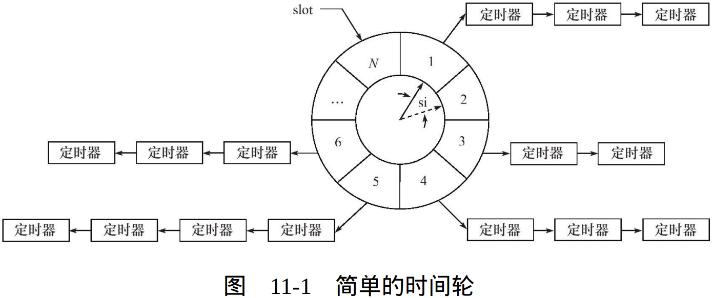

## 10.4 统一事件源

**信号是一种异步事件：**

信号处理函数和程序的主循环是两条不同的执行路线。很显然，信号处理函数需要尽可能快地执行完毕，以确保该信号不被屏蔽（前面提到过，为了避免一些竞态条件，信号在处理期间，系统不会再次触发它）太久。

**一种典型的解决方案是：**

- 把信号的主要处理逻辑放到程序的主循环中
- 当信号处理函数被触发时， 它只是简单地通知主循环程序接收到信号，并把信号值传递给主循环
- 主循环再根据接收到的信号值执行目标信号对应的逻辑代码。

**信号处理函数通常使用管道来将信号“传递”给主循环**：

- 信号处理函数往管道的写端写入信号值
- 主循环则从管道的读端读出该信号值

**那么主循环怎么知道管道上何时有数据可读呢?**

这很简单，我们只需要使用 I/O 复用系统调用来监听管道的读端文件描述符上的可读事件。如此一来，信号事件就能和其他 I/O 事件一样被处理，即统一事件源。 

> 很多优秀的I/O框架库和后台服务器程序都统一处理信号和 I/O 事件，比如 Libevent I/O 框架库和 xinetd 超级服务。

## 11.4.1 时间轮

**基于排序链表的定时器**存在一个问题：添加定时器的效率偏低。下面我们要讨论的时间轮解决了这个问题。一种简单的时间轮如图所示：

（实线）指针指向轮子上的一个槽 （slot）。它以恒定的速度顺时针转动，每转动一步就指向下一个槽 （虚线指针指向的槽），每次转动称为一个滴答（tick）。一个滴答的时间称为时间轮的槽间隔 si（slot interval），它实际上就是心搏时间。 该时间轮共有N个槽，因此它运转一周的时间是 N * si。每个槽指向一条定时器链表，每条链表上的定时器具有相同的特征：它们的定时时间相差 N * si 的整数倍。时间轮正是利用这个关系将定时器散列到不同的链表中。

`公式：ts = ( cur_slot + ( ticks % N ) ) % N;`

- **基于排序链表的定时器使用唯一的一条链表来管理所有定时器， 所以插入操作的效率随着定时器数目的增多而降低。**
- **时间轮使用哈希表的思想，将定时器散列到不同的链表上。这样每条链表上的定时器数目都将明显少于原来的排序链表上的定时器数目，插入操作的效 率基本不受定时器数目的影响。** 

很显然，对时间轮而言，要提高定时精度，就要使 si 值足够小；要提高执行效率，则要求 N 值足够大。 图11-1 描述的是一种简单的时间轮，因为它只有一个轮子。而复杂的时间轮可能有多个轮子，不同的轮子拥有不同的粒度。相邻的两个轮子，精度高的转一圈，精度低的仅往前移动一槽，就像水表一样。

## 11.4.2 时间堆 

前面讨论的定时方案都是以**固定的频率**调用心搏函数 tick()，并在其中依次检测到期的定时器，然后执行到期定时器上的回调函数。

设计定时器的另外一种思路是：

1. **将所有定时器中超时时间最小的一个定时器的超时值作为心搏间隔。**
2. **一旦心搏函数 tick() 被调用，超时时间最小的定时器必然到期，我们就可以在tick() 函数中处理该定时器。**
3. **然后，再次从剩余的定时器中找出超时时间最小的一个，并将这段最小时间设置为下一次心搏间隔。**
4. **如此反复，就实现了较为精确的定时。** 

最小堆很适合处理这种定时方案。

- **对时间轮而言，添加一个定时器的时间复杂度是 O(1)， 删除一个定时器的时间复杂度也是 O(1)，执行一个定时器的时间复 杂度是 O(n)。**
- **对升序链表而言，添加定时器的时间复杂度是 O(n)，删除定时器的时间复杂度是 O(1)，执行定时任务的时间复杂度是 O(1)。**

- **对时间堆而言，添加一个定时器的时间复杂度是O（lgn），删除一个定时器的时间复杂度是O（1），执行一个定时器的时间复杂度是O（1）。因此，时间堆的效率是很高的。**

