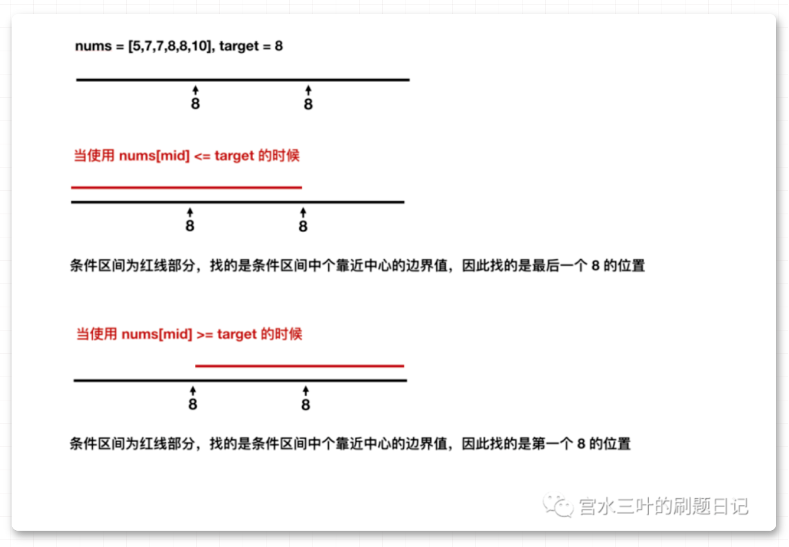

# [704. 二分查找](https://leetcode-cn.com/problems/binary-search/)

**4-24二刷**

给定一个 `n` 个元素有序的（升序）整型数组 `nums` 和一个目标值 `target` ，写一个函数搜索 `nums` 中的 `target`，如果目标值存在返回下标，否则返回 `-1`。

**示例 1:**

```
输入: nums = [-1,0,3,5,9,12], target = 9
输出: 4
解释: 9 出现在 nums 中并且下标为 4
```

**示例 2:**

```
输入: nums = [-1,0,3,5,9,12], target = 2
输出: -1
解释: 2 不存在 nums 中因此返回 -1
```

### 二分法第一种写法

定义target在区间[left, right]：

- while (left <= right) 要使用 <= ，因为left == right是有意义的，所以使用 <=
- if (nums[middle] > target) right 要赋值为 middle - 1，因为当前这个nums[middle]一定不是target，那么接下来要查找的左区间结束下标位置就是 middle - 1

```c++
class Solution {
public:
    int search(vector<int>& nums, int target) {
        int left = 0;
        int right = nums.size() - 1;
        while(left <= right){
            int middle = left + ((right - left) / 2);// 防止溢出 等同于(left + right)/2
            if (nums[middle] > target) {
                right = middle - 1; // target 在左区间，所以[left, middle - 1]
            } else if (nums[middle] < target) {
                left = middle + 1; // target 在右区间，所以[middle + 1, right]
            } else { // nums[middle] == target
                return middle; // 数组中找到目标值，直接返回下标
            }
        }
        return -1;
    }
};
```

### 二分法第二种写法

定义target在区间[left, right)

- while (left < right)，这里使用 < ,因为left == right在区间[left, right)是没有意义的
- if (nums[middle] > target) right 更新为 middle，因为当前nums[middle]不等于target，去左区间继续寻找，而寻找区间是左闭右开区间，所以right更新为middle，即：下一个查询区间不会去比较nums[middle]

```cpp
// 版本二
class Solution {
public:
    int search(vector<int>& nums, int target) {
        int left = 0;
        int right = nums.size(); // 定义target在左闭右开的区间里，即：[left, right)
        while (left < right) { // 因为left == right的时候，在[left, right)是无效的空间，所以使用 <
            int middle = left + ((right - left) >> 1);
            if (nums[middle] > target) {
                right = middle; // target 在左区间，在[left, middle)中
            } else if (nums[middle] < target) {
                left = middle + 1; // target 在右区间，在[middle + 1, right)中
            } else { // nums[middle] == target
                return middle; // 数组中找到目标值，直接返回下标
            }
        }
        // 未找到目标值
        return -1;
    }
};
```

### 相关题目：

# [34. 在排序数组中查找元素的第一个和最后一个位置](https://leetcode-cn.com/problems/find-first-and-last-position-of-element-in-sorted-array/)

**4-24二刷**

给定一个按照升序排列的整数数组 `nums`，和一个目标值 `target`。找出给定目标值在数组中的开始位置和结束位置。

如果数组中不存在目标值 `target`，返回 `[-1, -1]`。

**进阶：**

- 你可以设计并实现时间复杂度为 `O(log n)` 的算法解决此问题吗？

**示例 1：**

```
输入：nums = [5,7,7,8,8,10], target = 8
输出：[3,4]
```

**示例 2：**

```
输入：nums = [5,7,7,8,8,10], target = 6
输出：[-1,-1]
```

**示例 3：**

```
输入：nums = [], target = 0
输出：[-1,-1]
```

### 两次二分查找确认左右边界



### 思考

算法思想：使用两次二分查找来分别确认左右边界

因为已知数组按升序排列且target可能存在多个，所以：

寻找左边界时：

- **当target > nums[mid]，说明nums[mid] != target且target有可能全在mid右边，所以此时left=mid+1。**
- **当target <= nums[mid]，说明可能nums[mid] == target且target有可能全在mid左边，此时无法确定左边界，所以此时应该right=mid-1来缩小边界。**
- 最后对找到的左边界进行判断，可能超出数值范围或者target不存在

寻找右边界时：

- **当target < nums[mid]，说明nums[mid] != target且target有可能全在mid左边，所以此时right=mid-1。**
- **当target >= nums[mid]，说明可能nums[mid] == target且target有可能全在mid右边，此时无法确定右边界，所以此时应该left=mid+1来缩小边界。**
- 最后对找到的右边界进行判断，可能超出数值范围或者target不存在

```c++
class Solution {
public:
    vector<int> searchRange(vector<int>& nums, int target) {
        vector<int> v;
        int lb = leftBorder(nums, target);
        int rb = rightBorder(nums, target);
        v.push_back(lb);	//先左边界后右边界
        v.push_back(rb);
        return v;
    }
    int leftBorder(vector<int> nums, int target) {
        int left = 0;
        int right = nums.size() - 1;
        while (left <= right) {
            int mid = left + (right - left) / 2;
            if (target > nums[mid])	
                //数组按照升序排列且target > nums[mid]，说明target都在mid右边
                left = mid + 1;		
            else	
                //target <= nums[mid]时，target都在mid左边且可能包含mid，右边界移动，不影响左边界
                right = mid - 1;
        } 
        // left 总是往右缩进所以不用判断 < 0 的情况
        if (left >= nums.size() || nums[left] != target)
            return -1;	//对缩进后的边界进行判断，可能超出数值范围或者target不存在
        return left;
    }
    int rightBorder(vector<int> nums, int target) {
        int left = 0;
        int right = nums.size() - 1;
        while (left <= right) {
            int mid = left + (right - left) / 2;
            if (target < nums[mid])	//数组按照升序排列且target < nums[mid]，说明target都在mid左边
                right = mid - 1;
            else	//target >= nums[mid]时，target都在mid右边且可能包含mid，左边界移动，不影响右边界
                left = mid + 1; 
        }
        // right 总是往左缩进所以不用判断 >= nums.size() 的情况
        if (right < 0 || nums[right] != target)	
            return -1;
        return right;
    }
};
```

# [35. 搜索插入位置](https://leetcode-cn.com/problems/search-insert-position/)

**4-24二刷**

给定一个排序数组和一个目标值，在数组中找到目标值，并返回其索引。如果目标值不存在于数组中，返回它将会被按顺序插入的位置。

请必须使用时间复杂度为 `O(log n)` 的算法。

**示例 1:**

```
输入: nums = [1,3,5,6], target = 5
输出: 2
```

**示例 2:**

```
输入: nums = [1,3,5,6], target = 2
输出: 1
```

**示例 3:**

```
输入: nums = [1,3,5,6], target = 7
输出: 4
```

**示例 4:**

```
输入: nums = [1,3,5,6], target = 0
输出: 0
```

**示例 5:**

```
输入: nums = [1], target = 0
输出: 0
```

**提示:**

- `1 <= nums.length <= 104`
- `-104 <= nums[i] <= 104`
- `nums` 为**无重复元素**的**升序**排列数组
- `-104 <= target <= 104`

### 二分查找

```c++
class Solution {
public:
    int searchInsert(vector<int>& nums, int target) {
        int left = 0;
        int right = nums.size() - 1;
        while(left <= right){
            int mid = left + ((right - left) );
            if(target < nums[mid])
                right = mid - 1;
            else if(target > nums[mid])
                left = mid + 1;
            else    
                return mid;
        }
        return left; 
    }
};
```
