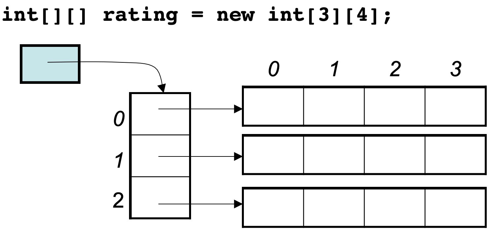

# 数组理论基础

**数组是存放在连续内存空间上的相同类型数据的集合。**

数组可以方便的通过下标索引的方式获取到下标下对应的数据。


需要两点注意的是

- **数组下标都是从0开始的。**
- **数组内存空间的地址是连续的**

正是**因为数组的在内存空间的地址是连续的，所以我们在删除或者增添元素的时候，就难免要移动其他元素的地址。**

例如删除下标为3的元素，需要对下标为3的元素后面的所有元素都要做移动操作，如图所示：


***C++要注意vector 和 array的区别，vector的底层实现是array，严格来讲vector是容器，不是数组。***

**数组的元素是不能删的，只能覆盖。**

### 二维数组


**那么二维数组在内存的空间地址是连续的么？**

不同编程语言的内存管理是不一样的，以C++为例，在C++中二维数组是连续分布的。

```cpp
void test_arr() {
    int array[2][3] = {
		{0, 1, 2},
		{3, 4, 5}
    };
    cout << &array[0][0] << " " << &array[0][1] << " " << &array[0][2] << endl;
    cout << &array[1][0] << " " << &array[1][1] << " " << &array[1][2] << endl;
}

int main() {
    test_arr();
}
```

```text
0x7ffee4065820 0x7ffee4065824 0x7ffee4065828
0x7ffee406582c 0x7ffee4065830 0x7ffee4065834
```

注意地址为16进制，可以看出二维数组地址是连续一条线的。

0x7ffee4065820 与 0x7ffee4065824 差了一个4，就是4个字节，因为这是一个int型的数组，所以两个相邻数组元素地址差4个字节。

0x7ffee4065828 与 0x7ffee406582c 也是差了4个字节，在16进制里8 + 4 = c，c就是12。

如图：


**所以可以看出在C++中二维数组在地址空间上是连续的**。

像Java是没有指针的，同时也不对程序员暴露其元素的地址，寻址操作完全交给虚拟机。

```java
public static void test_arr() {
    int[][] arr = {{1, 2, 3}, {3, 4, 5}, {6, 7, 8}, {9,9,9}};
    System.out.println(arr[0]);
    System.out.println(arr[1]);
    System.out.println(arr[2]);
    System.out.println(arr[3]);
}
```

```text
[I@7852e922
[I@4e25154f
[I@70dea4e
[I@5c647e05
```

这里的数值也是16进制，这不是真正的地址，而是经过处理过后的数值了，二维数组的每一行头结点的地址是没有规则的，更谈不上连续。

所以Java的二维数组可能是如下排列的方式：



所以在**java**中**二维数据在内存中不是 `3*4` 的连续地址空间，而是四条连续的地址空间组成！**