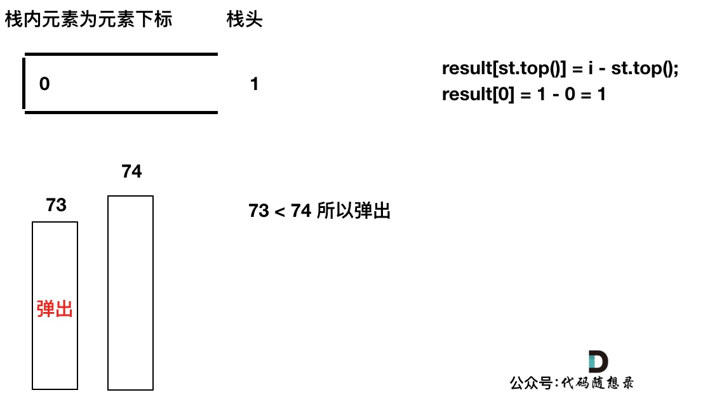

# [739. 每日温度](https://leetcode-cn.com/problems/daily-temperatures/)

给定一个整数数组 `temperatures` ，表示每天的温度，返回一个数组 `answer` ，其中 `answer[i]` 是指在第 `i` 天之后，才会有更高的温度。如果气温在这之后都不会升高，请在该位置用 `0` 来代替。

**示例 1:**

```
输入: temperatures = [73,74,75,71,69,72,76,73]
输出: [1,1,4,2,1,1,0,0]
```

**示例 2:**

```
输入: temperatures = [30,40,50,60]
输出: [1,1,1,0]
```

**示例 3:**

```
输入: temperatures = [30,60,90]
输出: [1,1,0]
```

**提示：**

- `1 <= temperatures.length <= 105`
- `30 <= temperatures[i] <= 100`

###  暴力匹配

```c++
// 超时
class Solution {
public:
    vector<int> dailyTemperatures(vector<int>& temperatures) {
        int n = temperatures.size();
        vector<int> answer(n, 0);
        for (int i = 0; i < n; i++)
            for (int j = i + 1; j < n; j++)
                if (temperatures[j] > temperatures[i]) {
                    answer[i] = j - i;
                    break;
                }    
        return answer;
    }
};
```

### 单调栈

- **单调栈里存放元素的下标**
- **当前遍历的元素 T[i] 小于等于栈顶元素 T[st.top()]**
  - **当前元素下标 i 入栈**
- **当前遍历的元素 T[i] 大于栈顶元素T[st.top()]**
  - **当栈不为空且当前元素持续大于栈顶元素**
    - **result[st.top()] = i - st.top();**
    - **弹出栈顶**
  - **当前元素下标 i 入栈**




...

...

...


```c++
class Solution {
public:
    vector<int> dailyTemperatures(vector<int>& temperatures) {
        int n = temperatures.size();
        vector<int> result(n, 0);
        stack<int> st;
        st.push(0); // 直接将首元素下标入栈
        for (int i = 1; i < n; i++) {
            if (temperatures[i] <= temperatures[st.top()]) { // 小于栈顶
                st.push(i); // 入栈
            } else {
                // 持续弹出并更新对应弹出下标的 result[]
                while (!st.empty() && temperatures[i] > temperatures[st.top()]) {
                    result[st.top()] = i - st.top();
                    st.pop();
                }
                // 也要入栈
                st.push(i);
            }
        }
        return result;
    }
};
```

```c++
// 代码精简版
class Solution {
public:
    vector<int> dailyTemperatures(vector<int>& temperatures) {
        int n = temperatures.size();
        vector<int> result(n, 0);
        stack<int> st;
        for (int i = 0; i < n; i++) {
            while (!st.empty() && temperatures[i] > temperatures[st.top()]) {
                result[st.top()] = i - st.top();
                st.pop();
            }
            st.push(i);
        }
        return result;
    }
};
```

