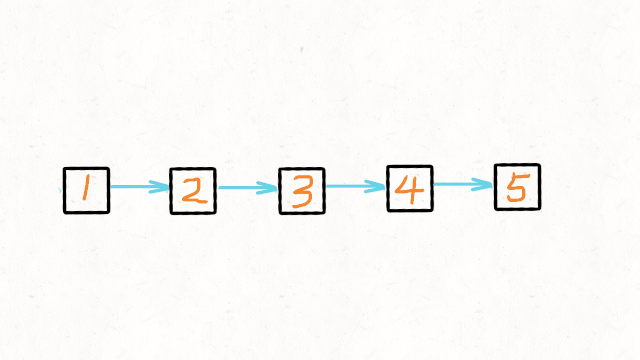

# [206.反转链表](https://leetcode-cn.com/problems/reverse-linked-list/)

**4-27二刷**

给你单链表的头节点 `head` ，请你反转链表，并返回反转后的链表。

**示例 1：**


```
输入：head = [1,2,3,4,5]
输出：[5,4,3,2,1]
```

**示例 2：**


```
输入：head = [1,2]
输出：[2,1]
```

**示例 3：**

```
输入：head = []
输出：[]
```

**提示：**

- 链表中节点的数目范围是 `[0, 5000]`
- `-5000 <= Node.val <= 5000`

**进阶：**链表可以选用迭代或递归方式完成反转。你能否用两种方法解决这道题？

### 双指针法一


**只需要改变链表的next指针的指向，直接将链表反转 ，而不用重新定义一个新的链表。**

```c++
class Solution {
public:
    ListNode* reverseList(ListNode* head) {
        ListNode* cur = head;
        ListNode* pre = nullptr;
        while (cur) {
            ListNode* tmp = cur->next;	//保存cur的下一结点，因为cur的指向准备改变
            cur->next = pre;
            pre = cur;
            cur = tmp;
        }
        return pre;	//pre指针指向原本的最后一个结点，也就是新的头结点
    }
};
```

### 双指针法二


- **原链表的头结点就是反转之后链表的尾结点，使用 head 标记 .**
- **定义指针 cur，初始化为 head**
- **每次都让 head 下一个结点的 next 指向 cur，实现一次局部反转**
- **局部反转完成之后，cur 和 head 的 next 指针同时 往前移动一个位置**
- **循环上述过程，直至 cur 到达链表的最后一个结点** 

```c++
class Solution {
public:
    ListNode* reverseList(ListNode* head) {
        if (head == NULL) { return NULL; }
        ListNode* cur = head;
        while (head->next != NULL) {
            ListNode* t = head->next->next;
            head->next->next = cur;
            cur = head->next;
            head->next = t;
        }
        return cur;
    }
};
```

### 递归法一

**正序反转，其实和双指针法一是一样的逻辑，同样是当cur为空的时候循环结束，不断将cur指向pre的过程。**

```c++
class Solution {
public:
    ListNode* reverse(ListNode* cur, ListNode* pre) {
        if (cur == nullptr) return pre;
        ListNode* tmp = cur->next; // 保存cur的下一个结点
        cur->next = pre;
        pre = cur;
        return reverse(tmp, pre);
    }
    ListNode* reverseList(ListNode* head) {
        return reverse(head, nullptr);
    }
};
```

### 递归法二

**倒序反转，从后往前反转**



```c++
class Solution {
public:
    ListNode* reverseList(ListNode* head) {
        // 递归终止条件
        // 第一项为了检测输入空指针的情况
        // 第二项为了判断到达尾结点的情况，大部分都是根据这个条件返回结束递归
        // 注意此处head == nullptr应该在前面，否则当输入为[]时会报错,因为head->next不存在
        if (head == nullptr || head->next == nullptr) return head;
        ListNode* newHead = reverseList(head->next);
        head->next->next = head; // 局部翻转链表
        head->next = nullptr; // 总是让局部尾结点指向 nullptr，就不用单独处理原来的头结点
        return newHead; // 返回新的头结点
    }
};
```

- **通过不断递归找到尾结点并复制给newHead（即反转后的头结点）**
- **之后的return中newHead值保持不变**
- **后面的每一层递归中进行一次局部的反转**
- **当本层结束后跳到上一层时便回到前一个结点，然后进行局部反转并添加一个nullptr**
- **直至原本的头结点，实现了从后往前进行反转**
