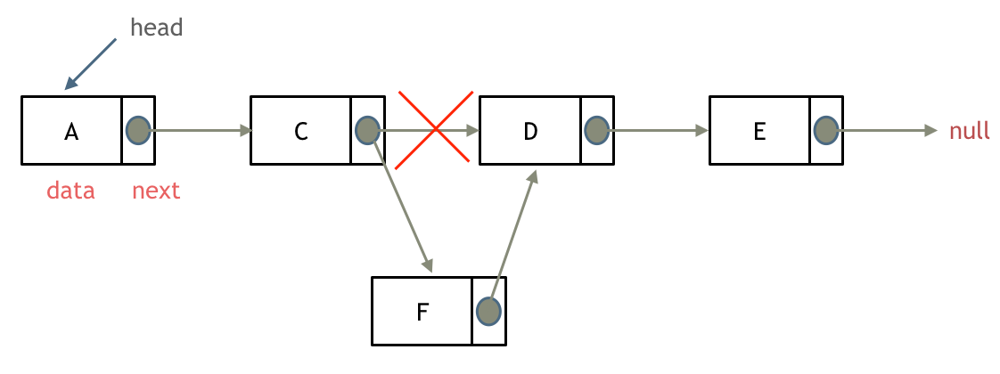

# 链表理论基础

什么是链表？链表是一种通过指针串联在一起的线性结构，每一个节点由两部分组成，一个是数据域一个是指针域（存放指向下一个节点的指针），最后一个节点的指针域指向null（空指针的意思）。

链接的入口节点称为链表的头结点也就是head。

如图所示： 

### 单链表

如上所述

### 双链表

单链表中的节点只能指向节点的下一个节点。

双链表：每一个节点有两个指针域，一个指向下一个节点，一个指向上一个节点。

双链表 既可以向前查询也可以向后查询。

### 循环链表

顾名思义，就是链表首尾相连。循环链表可以用来解决约瑟夫环问题。


### 链表的存储方式

**数组是在内存中是连续分布的，但是链表在内存中可不是连续分布的。**

链表是通过指针域的指针链接在内存中各个节点。

所以链表中的节点在内存中不是连续分布的 ，而是散乱分布在内存中的某地址上，分配机制取决于操作系统的内存管理。


*这个链表起始节点为2， 终止节点为7， 各个节点分布在内存个不同地址空间上，通过指针串联在一起。*

### 链表的定义

C/C++的定义链表节点方式：

```cpp
// 单链表
struct ListNode {
    int val;  // 节点上存储的元素
    ListNode *next;  // 指向下一个节点的指针
    ListNode(int x) : val(x), next(NULL) {}  // 节点的构造函数
};
```

如果不定义构造函数，C++默认生成一个构造函数

**但是这个构造函数不会初始化任何成员变量**

通过自己定义构造函数初始化节点：

```cpp
ListNode* head = new ListNode(5);
```

使用默认构造函数初始化节点：

```cpp
ListNode* head = new ListNode();
head->val = 5;
```

***所以如果不定义构造函数使用默认构造函数的话，在初始化的时候就不能直接给变量赋值！***

###  删除节点


删除D节点，只要将C节点的next指针指向E节点就可以了。

那么D节点不是依然存留在内存里么？只不过是没有在这个链表里而已。

是这样的，所以在C++里最好是再手动释放这个D节点，释放这块内存。

**其他语言例如Java、Python，就有自己的内存回收机制，就不用自己手动释放了。**

###  添加节点



可以看出链表的增添和删除都是$O(1)$操作，也不会影响到其他节点。

但是要注意，要是删除第五个节点，需要从头节点查找到第四个节点通过next指针进行删除操作，查找的时间复杂度是$O(n)$。

### 虚拟头结点

链表的一大问题就是操作当前节点必须要找前一个节点才能操作。这就造成了头结点的尴尬，因为头结点没有前一个节点了。

**每次对应头结点的情况都要单独处理，所以使用虚拟头结点的技巧，就可以解决这个问题**。

### 性能分析


数组在定义的时候，长度就是固定的，如果想改动数组的长度，就需要重新定义一个新的数组。

链表的长度可以是不固定的，并且可以动态增删， 适合数据量不固定，频繁增删，较少查询的场景。

### 关于NULL和nullptr

C++11以后引入了`nullptr`

NULL是一个常量，既然是常量，就需要进行宏定义。C语言的标准头文件是这样定义的

```cpp
 #define NULL ((void*)0)
```

而到了C++中，则变成了

```cpp
#define NULL 0
```

查阅stddef.h，可以看到如下定义

```cpp
#undef NULL
#if defined(__cplusplus)
#define NULL 0
#else
#define NULL ((void *)0)
#endif
```

从定义中可以看出，C++中，NULL其实就是0，但是也可以用作空指针，只是用作空指针可能是为了兼容C。

以下一段代码可以很好地解释NULL存在的问题：

```cpp
#include<iostream>
using namespace std;
void test(void *p)
{
    cout<<"p is pointer "<<p<<endl;
 }
void test(int num)
{
    cout<<"num is int "<<num<<endl; 
}
int main(void)
{
    test(NULL);
    return 0; 
}
```

这时，如果编译的话，会报以下错误，

```php
$ g++ -o test test.cpp
    main.cpp: In function ‘int main()’:
    main.cpp:14:14: error: call of overloaded ‘test(NULL)’ is ambiguous
         test(NULL);
```

很明显，NULL存在**二义性，它既是整数，也是一个指针**，函数`test()`无法根据参数的数据类型判断应该调用哪一个。

这时使用nullptr的优越性就体现出来了，因为它可以很好地把空指针这一层意思给剥离出来。

nullptr就是C++11为了解决这个痛点而推出的东西。

**因此，以后若想使用整数特性，就赋值为0，若想使用指针特性，就赋值为nullptr**

为什么要作此改动，首先应该是C和C++在处理void *类型的时候存在一定的区别。*

*C语言中，void* 类型的变量可以赋值给任意类型的指针，也可以被任意类型的指针赋值，两个方向都不会报错。

但是C++具有更严格的类型检查，前者是不被允许的。

因此下面一段C语言代码是可以编译通过的：

```cpp
int main()
{
    void* a;
    int* b=a;
}
```

但是下面的C++代码就会报错：

```go
test.cpp:4:7: error: cannot initialize a variable of type 'int *' with an lvalue of type 'void *'
int* b=a;
```

与此同时，在malloc上，也存在类似的问题：

```cpp
int len = 100;
int p = malloc(len * sizeof(int)); // C推荐做法
int p = (int )malloc(len * sizeof(int)); // C++推荐做法
```

malloc函数返回值得类型是 void，C不要求强制类型转换，会自动进行隐式转换。

但是C++则需要，因为void不能转换成其他类型的指针。
