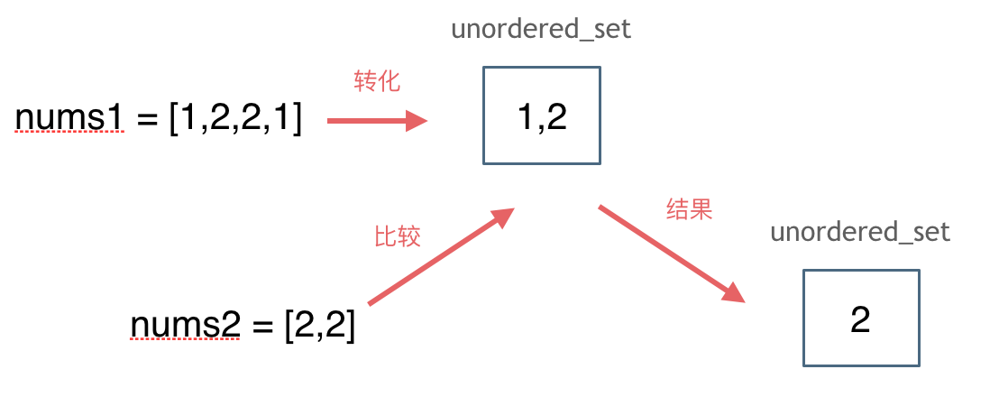

# [349. 两个数组的交集](https://leetcode-cn.com/problems/intersection-of-two-arrays/)

**5-2二刷**

给定两个数组，编写一个函数来计算它们的交集。

**示例 1：**

```
输入：nums1 = [1,2,2,1], nums2 = [2,2]
输出：[2]
```

**示例 2：**

```
输入：nums1 = [4,9,5], nums2 = [9,4,9,8,4]
输出：[9,4]
```

**说明：**

- 输出结果中的每个元素一定是唯一的。
- 我们可以不考虑输出结果的顺序。

### unordered_set哈希表

**这道题目没有限制数值的大小，就无法使用数组来做哈希表了。**

**而且如果哈希值比较少、特别分散、跨度非常大，使用数组就造成空间的极大浪费。**

**关于set，C++ 给提供了如下三种可用的数据结构：**

- **std::set**
- **std::multiset**
- **std::unordered_set**

**std::set和std::multiset底层实现都是红黑树（自动排序），std::unordered_set的底层实现是哈希表，** 

**使用unordered_set 读写效率是最高的，并不需要对数据进行排序，而且还不要让数据重复。**



```c++
class Solution {
public:
    vector<int> intersection(vector<int>& nums1, vector<int>& nums2) {
        unordered_set<int> resultSet;
        unordered_set<int> numSet(nums1.begin(), nums1.end()); 
        for (int& num : nums2)
            if (numSet.find(num) != numSet.end())
                resultSet.insert(num);
        return vector<int>(resultSet.begin(), resultSet.end());
    }
};
```

### 排序双指针

```c++
class Solution {
public:
    vector<int> intersection(vector<int>& nums1, vector<int>& nums2) {
        sort(nums1.begin(), nums1.end());
        sort(nums2.begin(), nums2.end());
        vector<int> result;
        int index1 = 0, index2 = 0;
        while (index1 < nums1.size() && index2 < nums2.size()) {
            if (nums1[index1] > nums2[index2]) {
                index2++;
            } else if (nums1[index1] < nums2[index2]) {
                index1++;
            } else {
                if (!result.size() || nums1[index1] != result.back())
				//注意这个判断条件，当result里无元素时无法调用.back()，报错
                    result.emplace_back(nums1[index1]);
                index1++;
                index2++;    
            }
        }
        return result;
    }
};
```

# [350. 两个数组的交集 II](https://leetcode-cn.com/problems/intersection-of-two-arrays-ii/)

给你两个整数数组 `nums1` 和 `nums2` ，请你以数组形式返回两数组的交集。返回结果中每个元素出现的次数，应与元素在两个数组中都出现的次数一致（如果出现次数不一致，则考虑取较小值）。可以不考虑输出结果的顺序。

**示例 1：**

```
输入：nums1 = [1,2,2,1], nums2 = [2,2]
输出：[2,2]
```

**示例 2:**

```
输入：nums1 = [4,9,5], nums2 = [9,4,9,8,4]
输出：[4,9]
```

**提示：**

- `1 <= nums1.length, nums2.length <= 1000`
- `0 <= nums1[i], nums2[i] <= 1000`

***\*进阶\**：**

- 如果给定的数组已经排好序呢？你将如何优化你的算法？
- 如果 `nums1` 的大小比 `nums2` 小，哪种方法更优？
- 如果 `nums2` 的元素存储在磁盘上，内存是有限的，并且你不能一次加载所有的元素到内存中，你该怎么办？

### 数组哈希表

```c++
class Solution {
public:
    vector<int> intersect(vector<int>& nums1, vector<int>& nums2) {
        vector<int> result;
        int count1[1001] = {0};
        int count2[1001] = {0};
        for (int& i : nums1)
            count1[i]++;
        for (int& i : nums2)
            count2[i]++;
        for (int i = 0; i < 1001; i++)
            while (count1[i]-- && count2[i]--)
                result.emplace_back(i);
        return result;
    }
};
```

### 排序双指针

**思路与上题相同，但无需判断重复。**

```c++
class Solution {
public:
    vector<int> intersect(vector<int>& nums1, vector<int>& nums2) {
        vector<int> result;
        sort(nums1.begin(), nums1.end());
        sort(nums2.begin(), nums2.end());
        int index1 = 0, index2 = 0;
        while (index1 < nums1.size() && index2 < nums2.size()) {
            if (nums1[index1] == nums2[index2]) {
                result.emplace_back(nums1[index1]);
                index1++;
                index2++;
            } else if (nums1[index1] > nums2[index2]) {
                index2++;
            } else {
                index1++;
            }
        }
        return result;
    }
};
```
