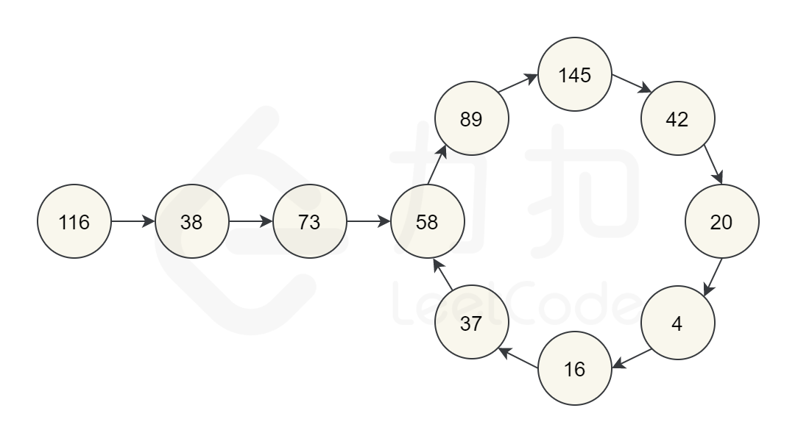

# [202. 快乐数](https://leetcode-cn.com/problems/happy-number/)

**5-3二刷**

编写一个算法来判断一个数 `n` 是不是快乐数。

「快乐数」定义为：

- 对于一个正整数，每一次将该数替换为它每个位置上的数字的平方和。
- 然后重复这个过程直到这个数变为 1，也可能是 **无限循环** 但始终变不到 1。
- 如果 **可以变为** 1，那么这个数就是快乐数。

如果 `n` 是快乐数就返回 `true` ；不是，则返回 `false` 。

**示例 1：**

```
输入：n = 19
输出：true
解释：
12 + 92 = 82
82 + 22 = 68
62 + 82 = 100
12 + 02 + 02 = 1
```

**示例 2：**

```
输入：n = 2
输出：false
```

**提示：**

- `1 <= n <= 231 - 1`

### unordered_set哈希表



**题目中提示了有"无限循环"的可能。**

**当sum重复出现时，一定会陷入死循环，所以需要判断sum是否有重复出现。**

**当我们遇到了要快速判断一个元素是否出现集合里的时候，就要考虑哈希法（unordered_set）了。**

**如果重复了就是return false， 否则一直找到sum为1为止。**

```c++
class Solution {
public:
    int getSum(int n) { //求各位数的平方和，easy
        int sum = 0;
        while (n) {
            sum += (n % 10) * (n % 10);
            n /= 10;
        }
        return sum;
    }
    bool isHappy(int n) {
        unordered_set<int> set;
        while (1) {
            int sum = getSum(n);
            if (sum == 1)
                return true;
            if (set.find(sum) != set.end())
                return false;
            else
                set.insert(sum);
            n = sum;
        }
    }
};
```

```c++
// 二刷
class Solution {
public:
    int getSum(int n) {
        int sum = 0;
        while (n > 0) {
            sum += (n % 10) * (n % 10);
            n /= 10;
        }
        return sum;
    }
    bool isHappy(int n) {
        unordered_set<int> hash;
        while (n != 1) {
            n = getSum(n);
            if (hash.count(n)) return false;
            hash.insert(n);
        }
        return true;
    }
};
```

### 双指针法

**因为无法预知循环的大小，使用集合 set 可能会过大以至于无法储存。**

**（同理递归也可能层次过深导致栈调用崩溃）**

- **使用快慢双指针判断死循环**
- **初始时快慢指针值应不同，进入循环后 slow 每次走一步，fast 每次走两步**
- **循环结束情况：**
  - **快慢指针同为sum为个位数的值（但不一定是快乐数）**
  - **快慢指针在循环中相遇而相同**
- **判断slow指针是否为一**
  - **slow == 1 说明是快乐数**
  - **slow != 1 说明陷入死循环**

```c++
class Solution {
public:
    int getSum(int n) {
        int sum = 0;
        while (n) {
            sum += (n % 10) * (n % 10);
            n /= 10;
        }
        return sum;
    }
    bool isHappy(int n) {
        int slow = n;
        int fast = getSum(n); //slow 和 fast 应有不同的初值
        while (slow != fast) {
            slow = getSum(slow);
            fast = getSum(fast);
            fast = getSum(fast);
        }
        return slow == 1;
    }
};
```

