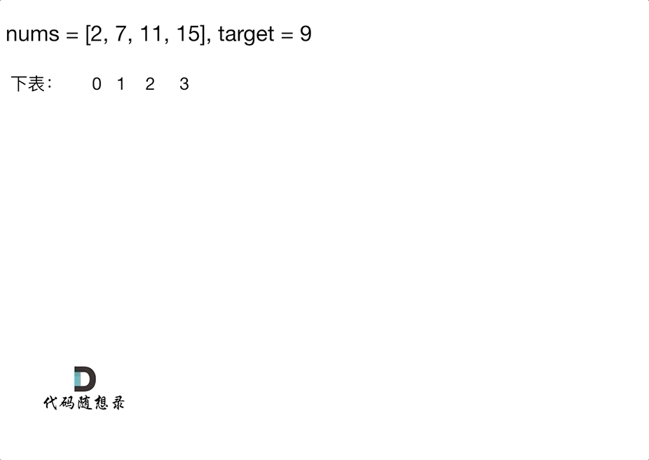

# [1. 两数之和](https://leetcode-cn.com/problems/two-sum/)

**5-3二刷**

给定一个整数数组 `nums` 和一个整数目标值 `target`，请你在该数组中找出 **和为目标值** *`target`* 的那 **两个** 整数，并返回它们的数组下标。

你可以假设每种输入只会对应一个答案。但是，数组中同一个元素在答案里不能重复出现。

你可以按任意顺序返回答案。

**示例 1：**

```
输入：nums = [2,7,11,15], target = 9
输出：[0,1]
解释：因为 nums[0] + nums[1] == 9 ，返回 [0, 1] 。
```

**示例 2：**

```
输入：nums = [3,2,4], target = 6
输出：[1,2]
```

**示例 3：**

```
输入：nums = [3,3], target = 6
输出：[0,1]
```

**提示：**

- `2 <= nums.length <= 104`
- `-109 <= nums[i] <= 109`
- `-109 <= target <= 109`
- **只会存在一个有效答案**

**进阶：**你可以想出一个时间复杂度小于 `O(n2)` 的算法吗？

### unordered_map哈希

[242. 有效的字母异位词](https://www.programmercarl.com/0242.有效的字母异位词.html)这道题目是用数组作为哈希表来解决哈希问题。

[349. 两个数组的交集](https://www.programmercarl.com/0349.两个数组的交集.html)这道题目是通过set作为哈希表来解决哈希问题。

使用数组和set来做哈希法的局限：

- 数组的大小是受限制的，而且如果元素很少，而哈希值太大会造成内存空间的浪费。
- set是一个集合，里面放的元素只能是一个key，而两数之和这道题目，不仅要判断y是否存在而且还要记录y的下标位置，因为要返回x 和 y的下标。所以set 也不能用。

此时就要选择另一种数据结构：map ，map是一种key value的存储结构，可以用key保存数值，用value在保存数值所在的下标。

C++中map，有三种类型：

| 映射               | 底层实现 | 是否有序 | 数值是否可以重复 | 能否更改数值 | 查询效率    | 增删效率    |
| :----------------- | :------- | -------- | ---------------- | ------------ | ----------- | ----------- |
| std::map           | 红黑树   | key有序  | key不可重复      | key不可修改  | $O(\log n)$ | $O(\log n)$ |
| std::multimap      | 红黑树   | key有序  | key可重复        | key不可修改  | $O(\log n)$ | $O(\log n)$ |
| std::unordered_map | 哈希表   | key无序  | key不可重复      | key不可修改  | $O(1)$      | $O(1)$      |

std::map 和std::multimap 的底层实现是**红黑树**。std::map 和std::multimap 的key是**有序**的（常作为面试题考察对语言容器底层的理解）。 

**这道题目中并不需要key有序，选择std::unordered_map 效率更高！**



```c++
class Solution {
public:
    vector<int> twoSum(vector<int>& nums, int target) {
        unordered_map<int, int> hash;
        for (int i = 0; i < nums.size(); i++) {
            auto it = hash.find(target - nums[i]); //寻找余值
            if (it != hash.end()) //在哈希找到了
                return {it->second, i};
            hash[nums[i]] = i; //以数值为key，下标为value
        }
        return {};
    }
};
```