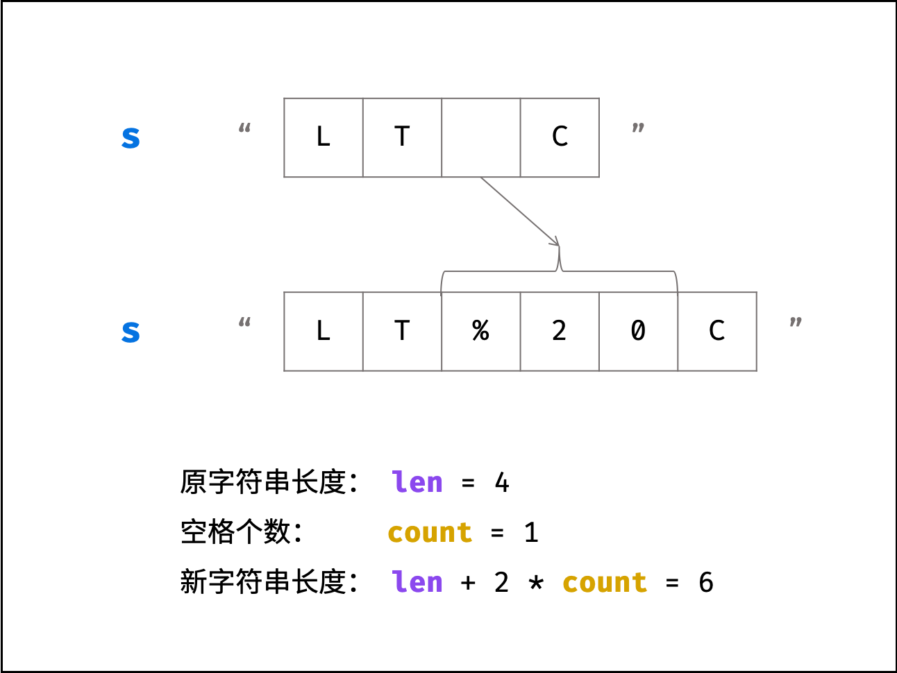

# [剑指 Offer 05. 替换空格](https://leetcode-cn.com/problems/ti-huan-kong-ge-lcof/)

**5-6二刷**

请实现一个函数，把字符串 `s` 中的每个空格替换成"%20"。

**示例 1：**

```
输入：s = "We are happy."
输出："We%20are%20happy."
```

**限制：**

```
0 <= s 的长度 <= 10000
```

### 双指针法



- **统计空格数量。**

- **扩容字符串。**

- **倒序遍历修改：i 指向原字符串尾部元素， j 指向新字符串尾部元素；当 i = j 时跳出（代表左方已没有空格，无需继续遍历）：**
- **当 s[i] 不为空格时：执行 s[j] = s[i] ；**
  
- **当 s[i] 为空格时：将字符串闭区间 [j-2, j] 的元素修改为 "%20" ；**

时间复杂度：$O(N)$ 。
空间复杂度：$O(1)$ 。

```c++
class Solution {
public:
    string replaceSpace(string s) {
        int count = 0;
        int oldSize = s.size();
        for (char x : s)
            if (x == ' ')
                count++;
        s.resize(oldSize + 2 * count);
        // resize 扩充后（大于原长度）保留原来的字符
        // i == j 时前方已经不存在空格了，无需修改
        for (int i = oldSize - 1, j = s.size() - 1; i < j; i--, j--) {
            if (s[i] == ' ') {
                s[j--] = '0';
                s[j--] = '2';
                s[j] = '%';
            } else {
                s[j] = s[i];
            }
        }
        return s;
    }
};
```

### 利用C++特性

```c++
class Solution {
public:
    string replaceSpace(string s) {
        string newS;
        for (char& c : s) {
            if (c == ' ') {
                newS.push_back('%');
                newS.push_back('2');
                newS.push_back('0');
            } else {
                newS.push_back(c);
            }
        }
        return newS;
    }
};
```

### 借助库函数

```c++
class Solution {
public:
    string replaceSpace(string s) {
        for (int i = 0; i < s.size(); i++) {
            if (s[i] == ' ') {
                s.replace(s.find(' '), s.size() - i, "%20" + s.substr(i + 1));
                i += 2;
            }
        }
        return s;
    }
};
```