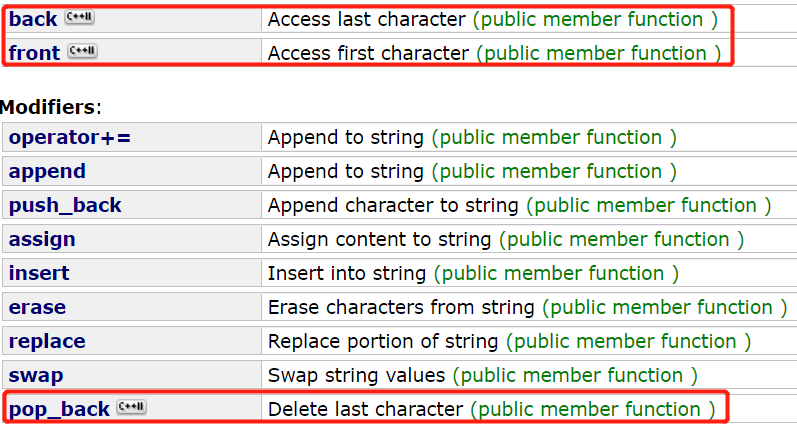

# [c1047. 删除字符串中的所有相邻重复项](https://leetcode-cn.com/problems/remove-all-adjacent-duplicates-in-string/)

**5-7二刷**

给出由小写字母组成的字符串 `S`，**重复项删除操作**会选择两个相邻且相同的字母，并删除它们。

在 S 上反复执行重复项删除操作，直到无法继续删除。

在完成所有重复项删除操作后返回最终的字符串。答案保证唯一。

**示例：**

```
输入："abbaca"
输出："ca"
解释：
例如，在 "abbaca" 中，我们可以删除 "bb" 由于两字母相邻且相同，这是此时唯一可以执行删除操作的重复项。之后我们得到字符串 "aaca"，其中又只有 "aa" 可以执行重复项删除操作，所以最后的字符串为 "ca"。
```

**提示：**

1. `1 <= S.length <= 20000`
2. `S` 仅由小写英文字母组成。

### 借助栈匹配

```c++
class Solution {
public:
    string removeDuplicates(string S) {
        stack<char> st;
        for (char s : S) {
            if (st.empty() || s != st.top()) {
                st.push(s);
            } else {
                st.pop();
            }
        }
        string result = "";
        while (!st.empty()) { //将栈中元素放到result字符串汇总
            result += st.top();
            st.pop();
        }
        reverse (result.begin(), result.end()); //反转字符串
        return result;

    }
};
```

### 字符串作栈

**利用 C++ 语言特性，可以直接拿字符串作为栈，这样省去了栈还要转为字符串的操作。**

**string 的 back()、front() 和 pop_back() 都是 C++ 11 的新特性**



- **时间复杂度：$O(n)$。只需要遍历该字符串一次。**
- **空间复杂度：$O(1)$，字符串类提供了类似「入栈」和「出栈」的接口。**

```c++
class Solution {
public:
    string removeDuplicates(string S) {
        string result;
        for(char s : S) {
            if(result.empty() || result.back() != s) {
                result.push_back(s);
            }
            else {
                result.pop_back();
            }
        }
        return result;
    }
};
```

