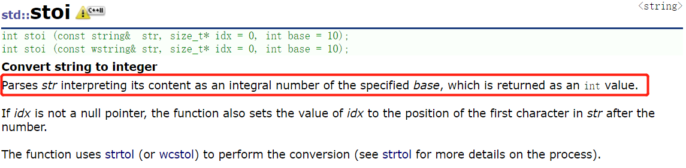

# [150. 逆波兰表达式求值](https://leetcode-cn.com/problems/evaluate-reverse-polish-notation/)

**5-7二刷**

根据[ 逆波兰表示法](https://baike.baidu.com/item/逆波兰式/128437)，求表达式的值。

有效的算符包括 `+`、`-`、`*`、`/` 。每个运算对象可以是整数，也可以是另一个逆波兰表达式。

**注意** 两个整数之间的除法只保留整数部分。

可以保证给定的逆波兰表达式总是有效的。换句话说，表达式总会得出有效数值且不存在除数为 0 的情况。

**示例 1：**

```
输入：tokens = ["2","1","+","3","*"]
输出：9
解释：该算式转化为常见的中缀算术表达式为：((2 + 1) * 3) = 9
```

**示例 2：**

```
输入：tokens = ["4","13","5","/","+"]
输出：6
解释：该算式转化为常见的中缀算术表达式为：(4 + (13 / 5)) = 6
```

**示例 3：**

```
输入：tokens = ["10","6","9","3","+","-11","*","/","*","17","+","5","+"]
输出：22
解释：该算式转化为常见的中缀算术表达式为：
  ((10 * (6 / ((9 + 3) * -11))) + 17) + 5
= ((10 * (6 / (12 * -11))) + 17) + 5
= ((10 * (6 / -132)) + 17) + 5
= ((10 * 0) + 17) + 5
= (0 + 17) + 5
= 17 + 5
= 22
```

**提示：**

- `1 <= tokens.length <= 104`
- `tokens[i]` 是一个算符（`"+"`、`"-"`、`"*"` 或 `"/"`），或是在范围 `[-200, 200]` 内的一个整数

**逆波兰表达式：**

逆波兰表达式是一种后缀表达式，所谓后缀就是指算符写在后面。

- 平常使用的算式则是一种中缀表达式，如 `( 1 + 2 ) * ( 3 + 4 )` 。
- 该算式的逆波兰表达式写法为 `( ( 1 2 + ) ( 3 4 + ) * )` 。

逆波兰表达式主要有以下两个优点：

- 去掉括号后表达式无歧义，上式即便写成 `1 2 + 3 4 + * `也可以依据次序计算出正确结果。
- 适合用栈操作运算：遇到数字则入栈；遇到算符则取出栈顶两个数字进行计算，并将结果压入栈中

### 利用栈


**C++ 知识补充：**

**stoi( ) 是 C++ 11 的新特性。**

****

- **stoi() 与 atoi()** 
  - **相同点：**
    - **都是C++的字符处理函数，把数字字符串转换成 int 输出。**
    - **头文件都是  #include <string>。**
  - **不同点：**
    - **atoi( ) 的参数是 const char* ,因此对于字符串 str 须调用 c_str( ) 将其转换成 const char 。**
    - **stoi( ) 的参数是 const string，不需要转化为 const char*。**
    - **stoi( ) 会做范围检查，默认范围是在 int 的范围内的，如果超出范围的话则会 runtime error！**
    - **atoi( )不会做范围检查，如果超出范围的话，超出上界，则输出上界，超出下界，则输出下界。**

```c++
public:
    int evalRPN(vector<string>& tokens) {
        stack<int> st;
        for (auto& c : tokens) {
            //注意此处容器是 string 类，所以要用 "" 而不是 ''
            if (c == "+" || c == "-" || c == "*" || c == "/") {
                int num1 = st.top();
                st.pop();
                int num2 = st.top();
                st.pop();
                if (c == "+") st.push(num2 + num1);
                if (c == "-") st.push(num2 - num1);
                if (c == "*") st.push(num2 * num1); 
                if (c == "/") st.push(num2 / num1); 
            } else {
                //atoi() 用法
                //st.push(atoi(c.c_str()));
                st.push(stoi(c));
            }
        }
        return st.top();
    }
};
```

