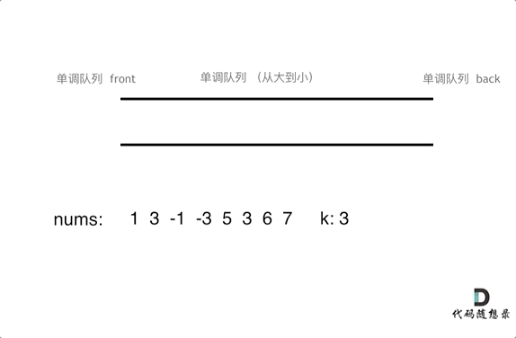

# [239. 滑动窗口最大值](https://leetcode-cn.com/problems/sliding-window-maximum/)

**5-7二刷**

给你一个整数数组 `nums`，有一个大小为 `k` 的滑动窗口从数组的最左侧移动到数组的最右侧。你只可以看到在滑动窗口内的 `k` 个数字。滑动窗口每次只向右移动一位。

返回 *滑动窗口中的最大值* 。

**示例 1：**

```
输入：nums = [1,3,-1,-3,5,3,6,7], k = 3
输出：[3,3,5,5,6,7]
解释：
滑动窗口的位置                最大值
---------------               -----
[1  3  -1] -3  5  3  6  7       3
 1 [3  -1  -3] 5  3  6  7       3
 1  3 [-1  -3  5] 3  6  7       5
 1  3  -1 [-3  5  3] 6  7       5
 1  3  -1  -3 [5  3  6] 7       6
 1  3  -1  -3  5 [3  6  7]      7
```

**示例 2：**

```
输入：nums = [1], k = 1
输出：[1]
```

**提示：**

- `1 <= nums.length <= 105`
- `-104 <= nums[i] <= 104`
- `1 <= k <= nums.length`

### 单调队列

**维护一个单调递减的 deque 双端队列。**

**新元素入队尾前，将前面所有小于它的元素都从队尾弹出 pop_back( )，所以队头总是其中最大的元素。**

**窗口滑动时，如果队头元素是窗口删去的元素，就将队头元素弹出，并将新入窗口的元素加入队列。**

**每次都将队头元素（最大值）加入 result。**

**队列维护情况：**


**整体情况：**



```c++
class myQueue {
public:
    deque<int> que;

    void pop(int value) {
        if (!que.empty() && value == que.front())
            que.pop_front();
    }

    void push(int value) {
        while (!que.empty() && value > que.back())
            que.pop_back();
        que.push_back(value);
    }

    int front() {
        return que.front();
    }
};
class Solution {
public:
    vector<int> maxSlidingWindow(vector<int>& nums, int k) {
        myQueue que;
        vector<int> result;
        for (int i = 0; i < k; i++)
            que.push(nums[i]);
        result.push_back(que.front());
        for (int i = k; i < nums.size(); i++) {
            que.pop(nums[i - k]);
            que.push(nums[i]);
            result.push_back(que.front());
        }
        return result;
    }
};
```

**思路明确后，无需借助 myQue 类也可以实现。**

```c++
class Solution {
public:
    vector<int> maxSlidingWindow(vector<int>& nums, int k) {
        deque<int> que;
        vector<int> result;
        for (int i = 0; i < k; i++) {
            while (!que.empty() && nums[i] > que.back())
                que.pop_back();
            que.push_back(nums[i]);
        }
        result.push_back(que.front());
        for (int i = k; i < nums.size(); i++) {
            if (!que.empty() && nums[i - k] == que.front())
                que.pop_front();
            while (!que.empty() && nums[i] > que.back())
                que.pop_back();
            que.push_back(nums[i]);
            result.push_back(que.front());
        }
        return result;
    }
};
```

