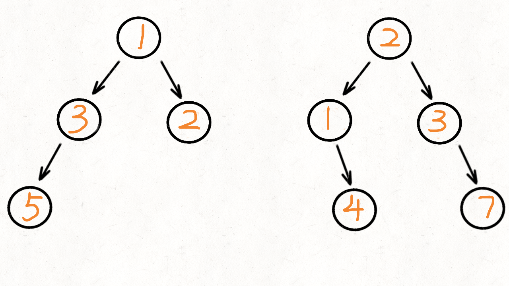

# [617. 合并二叉树](https://leetcode-cn.com/problems/merge-two-binary-trees/)

**5-12二刷**

给你两棵二叉树： `root1` 和 `root2` 。

想象一下，当你将其中一棵覆盖到另一棵之上时，两棵树上的一些节点将会重叠（而另一些不会）。你需要将这两棵树合并成一棵新二叉树。合并的规则是：如果两个节点重叠，那么将这两个节点的值相加作为合并后节点的新值；否则，**不为** null 的节点将直接作为新二叉树的节点。

返回合并后的二叉树。

**注意:** 合并过程必须从两个树的根节点开始。

**示例 1：**


```
输入：root1 = [1,3,2,5], root2 = [2,1,3,null,4,null,7]
输出：[3,4,5,5,4,null,7]
```

**示例 2：**

```
输入：root1 = [1], root2 = [1,2]
输出：[2,2]
```

**提示：**

- 两棵树中的节点数目在范围 `[0, 2000]` 内
- `-104 <= Node.val <= 104`

### 递归

```c++
//自己AC版，效率并不高(15.49%, 6.38%)，因为没有利用原本的树，每次都构建了新的节点。
class Solution {
public:
    TreeNode* mergeTrees(TreeNode* root1, TreeNode* root2) {
        if (root1 == nullptr && root2 == nullptr) return nullptr;
        int k;
        if (root1 == nullptr) k = root2->val;
        else if (root2 == nullptr) k = root1->val;
        else k = root1->val + root2->val;
        TreeNode* root = new TreeNode(k);
        root->left = mergeTrees(root1 ? root1->left : nullptr, root2 ? root2->left : nullptr);
        root->right = mergeTrees(root1 ? root1->right : nullptr, root2 ? root2->right : nullptr);
        return root;
    }
};
```

```c++
//前序遍历版，前中后序都可，前序最直接明了。
class Solution {
public:
    TreeNode* mergeTrees(TreeNode* root1, TreeNode* root2) {
        if (root1 == nullptr) return root2;
        if (root2 == nullptr) return root1;
        root1->val += root2->val; //以 root1 为基础树进行合并
        root1->left = mergeTrees(root1->left, root2->left);
        root1->right = mergeTrees(root1->right, root2->right);
        return root1;
    }
};
```

### 迭代法

- **两颗树的左节点都不为 null，就将他们加入队列中；**
  - **如果树 1 的 left 节点为 null，树 2 的 left 不为 null，直接将树 2 的 left 赋给树 1 。**
- **两棵树的右节点都不为 null ，也将他们加入队列中。**
  - **如果树 1 的 right 节点为 null，树 2 的 right 不为 null，直接将树 2 的 right 节点赋给树 1。**
- **然后不断的从队列中取出节点，把他们相加。**



```c++
class Solution {
public:
    TreeNode* mergeTrees(TreeNode* root1, TreeNode* root2) {
        if (root1 == nullptr) return root2;
        if (root2 == nullptr) return root1;
        queue<TreeNode*> que;
        que.push(root1);
        que.push(root2);
        while (!que.empty()) {
            TreeNode* node1 = que.front(); que.pop();
            TreeNode* node2 = que.front(); que.pop();
            node1->val += node2->val; //以 root1 为基础树进行合并
            //处理左节点
            if (node1->left && node2->left) {
                que.push(node1->left);
                que.push(node2->left);
            }
            if (!node1->left && node2->left)
                node1->left = node2->left;
            //处理右节点
            if (node1->right && node2->right) {
                que.push(node1->right);
                que.push(node2->right);
            }
            if (!node1->right && node2->right)
                node1->right = node2->right;
        }
        return root1;
    }
};
```

