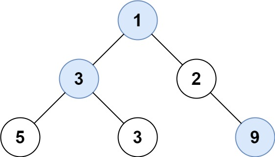

# [d102. 二叉树的层序遍历](https://leetcode-cn.com/problems/binary-tree-level-order-traversal/)

**5-9二刷**

给你二叉树的根节点 `root` ，返回其节点值的 **层序遍历** 。 （即逐层地，从左到右访问所有节点）。

**示例 1：**


```
输入：root = [3,9,20,null,null,15,7]
输出：[[3],[9,20],[15,7]]
```

**示例 2：**

```
输入：root = [1]
输出：[[1]]
```

**示例 3：**

```
输入：root = []
输出：[] 
```

**提示：**

- 树中节点数目在范围 `[0, 2000]` 内
- `-1000 <= Node.val <= 1000`

### 借助队列

**队列先进先出，一层层从左到右进行遍历。**


```c++
class Solution {
public:
    vector<vector<int>> levelOrder(TreeNode* root) {
        queue<TreeNode*> que;
        if (root != NULL) que.push(root);
        vector<vector<int>> result;
        while (!que.empty()) {
            int size = que.size();
            //记录当前队列元素个数，之后按顺序寻找其左右孩子，size 会不断变化。
            vector<int> vec;
            for (int i = 0; i < size; i++) {
                TreeNode* node = que.front();
                que.pop();
                vec.push_back(node->val);
                if (node->left) que.push(node->left);
                if (node->right) que.push(node->right);
            }
            result.push_back(vec);
        }
        return result;
    }
};
```

# [107. 二叉树的层序遍历 II](https://leetcode-cn.com/problems/binary-tree-level-order-traversal-ii/)

给你二叉树的根节点 `root` ，返回其节点值 **自底向上的层序遍历** 。 （即按从叶子节点所在层到根节点所在的层，逐层从左向右遍历）

**示例 1：**


```
输入：root = [3,9,20,null,null,15,7]
输出：[[15,7],[9,20],[3]]
```

**示例 2：**

```
输入：root = [1]
输出：[[1]]
```

**示例 3：**

```
输入：root = []
输出：[]
```

**提示：**

- 树中节点数目在范围 `[0, 2000]` 内
- `-1000 <= Node.val <= 1000`

### 返回前将二维数组reverse

```c++
class Solution {
public:
    vector<vector<int>> levelOrderBottom(TreeNode* root) {
        vector<vector<int>> result;
        if (!root) return result;
        queue<TreeNode*> que;
        que.push(root);
        while (!que.empty()) {
            int size = que.size();
            vector<int> vec;
            for (int i = 0; i < size; i++) {
                TreeNode* node = que.front();
                que.pop();
                vec.push_back(node->val);
                if (node->left) que.push(node->left);
                if (node->right) que.push(node->right);
            }
            result.push_back(vec);
        }
        reverse(result.begin(), result.end());
        return result;
    }
};
```

# [199. 二叉树的右视图](https://leetcode-cn.com/problems/binary-tree-right-side-view/)

给定一个二叉树的 **根节点** `root`，想象自己站在它的右侧，按照从顶部到底部的顺序，返回从右侧所能看到的节点值。

**示例 1:**


```
输入: [1,2,3,null,5,null,4]
输出: [1,3,4]
```

**示例 2:**

```
输入: [1,null,3]
输出: [1,3]
```

**示例 3:**

```
输入: []
输出: []
```

**提示:**

- 二叉树的节点个数的范围是 `[0,100]`
- `-100 <= Node.val <= 100` 

### **将每层遍历的最后一个元素加入result**

```c++
class Solution {
public:
    vector<int> rightSideView(TreeNode* root) {
        vector<int> result;
        if (!root) return result;
        queue<TreeNode*> que;
        que.push(root);
        while (!que.empty()) {
            int size = que.size();
            vector<int> vec;
            for (int i = 0; i < size; i++) {
                TreeNode* node = que.front();
                que.pop();
                vec.push_back(node->val);
                if (i == size - 1) result.push_back(node->val);
                if (node->left) que.push(node->left);
                if (node->right) que.push(node->right);
            }
        }
        return result;
    }
};
```

# [637. 二叉树的层平均值](https://leetcode-cn.com/problems/average-of-levels-in-binary-tree/)

给定一个非空二叉树的根节点 `root` , 以数组的形式返回每一层节点的平均值。与实际答案相差 `10-5` 以内的答案可以被接受。

**示例 1：**


```
输入：root = [3,9,20,null,null,15,7]
输出：[3.00000,14.50000,11.00000]
解释：第 0 层的平均值为 3,第 1 层的平均值为 14.5,第 2 层的平均值为 11 。
因此返回 [3, 14.5, 11] 。
```

**示例 2:**


```
输入：root = [3,9,20,15,7]
输出：[3.00000,14.50000,11.00000]
```

**提示：**

- 树中节点数量在 `[1, 104]` 范围内
- `-231 <= Node.val <= 231 - 1`

### 每层统计求和再取平均值

```c++
class Solution {
public:
    vector<double> averageOfLevels(TreeNode* root) {
        vector<double> result;
        if (!root) return result;
        queue<TreeNode*> que;
        que.push(root);
        while (!que.empty()) {
            int size = que.size();
            double sum = 0;
            for (int i = 0; i < size; i++) {
                TreeNode* node = que.front();
                que.pop();
                sum += node->val;
                if (node->left) que.push(node->left);
                if (node->right) que.push(node->right);
            }
            result.push_back(sum / size);
        }
        return result;
    }
};
```

# [429. N 叉树的层序遍历](https://leetcode-cn.com/problems/n-ary-tree-level-order-traversal/)

给定一个 N 叉树，返回其节点值的*层序遍历*。（即从左到右，逐层遍历）。

树的序列化输入是用层序遍历，每组子节点都由 null 值分隔（参见示例）。

**示例 1：**


```
输入：root = [1,null,3,2,4,null,5,6]
输出：[[1],[3,2,4],[5,6]]
```

**示例 2：**


```
输入：root = [1,null,2,3,4,5,null,null,6,7,null,8,null,9,10,null,null,11,null,12,null,13,null,null,14]
输出：[[1],[2,3,4,5],[6,7,8,9,10],[11,12,13],[14]]
```

**提示：**

- 树的高度不会超过 `1000`
- 树的节点总数在 `[0, 10^4]` 之间

### 结点有多个孩子，所以多一层循环

```c++
class Solution {
public:
    vector<vector<int>> levelOrder(Node* root) {
        vector<vector<int>> result;
        if (!root) return result;
        queue<Node*> que;
        que.push(root);
        while (!que.empty()) {
            int size = que.size();
            vector<int> vec;
            for (int i = 0; i < size; i++) {
                Node* node = que.front();
                que.pop();
                vec.push_back(node->val);
                for (int i = 0; i < node->children.size(); i++)
                    if (node->children[i]) que.push(node->children[i]);
            }
            result.push_back(vec);
        }
        return result;
    }
};
```

# [515. 在每个树行中找最大值](https://leetcode-cn.com/problems/find-largest-value-in-each-tree-row/)

给定一棵二叉树的根节点 `root` ，请找出该二叉树中每一层的最大值。

**示例1：**



```
输入: root = [1,3,2,5,3,null,9]
输出: [1,3,9]
```

**示例2：**

```
输入: root = [1,2,3]
输出: [1,3] 
```

**提示：**

- 二叉树的节点个数的范围是 `[0,104]`
- `-231 <= Node.val <= 231 - 1`

### 每层比较最大值

```c++
class Solution {
public:
    vector<int> largestValues(TreeNode* root) {
        vector<int> result;
        if (!root) return result;
        queue<TreeNode*> que;
        que.push(root);
        while (!que.empty()) {
            int size = que.size();
            int max = INT_MIN;
            for (int i = 0; i < size; i++) {
                TreeNode* node = que.front();
                que.pop();
                max = node->val > max ? node->val : max;
                if (node->left) que.push(node->left);
                if (node->right) que.push(node->right);
            }
            result.push_back(max);
        }
        return result;
    }
};
```

# [116. 填充每个节点的下一个右侧节点指针](https://leetcode-cn.com/problems/populating-next-right-pointers-in-each-node/)

**5-9二刷**

给定一个 **完美二叉树** ，其所有叶子节点都在同一层，每个父节点都有两个子节点。二叉树定义如下：

```
struct Node {
  int val;
  Node *left;
  Node *right;
  Node *next;
}
```

填充它的每个 next 指针，让这个指针指向其下一个右侧节点。如果找不到下一个右侧节点，则将 next 指针设置为 `NULL`。

初始状态下，所有 next 指针都被设置为 `NULL`。

**示例 1：**


```
输入：root = [1,2,3,4,5,6,7]
输出：[1,#,2,3,#,4,5,6,7,#]
解释：给定二叉树如图 A 所示，你的函数应该填充它的每个 next 指针，以指向其下一个右侧节点，如图 B 所示。序列化的输出按层序遍历排列，同一层节点由 next 指针连接，'#' 标志着每一层的结束。
```

**示例 2:**

```
输入：root = []
输出：[]
```

**提示：**

- 树中节点的数量在 `[0, 212 - 1]` 范围内
- `-1000 <= node.val <= 1000`

**进阶：**

- 你只能使用常量级额外空间。
- 使用递归解题也符合要求，本题中递归程序占用的栈空间不算做额外的空间复杂度。

### 除最后一个元素外的 next 都指向队头元素

```c++
class Solution {
public:
    Node* connect(Node* root) {
        if (!root) return root;
        queue<Node*> que;
        que.push(root);
        while (!que.empty()) {
            int size = que.size();
            for (int i = 0; i < size; i++) {
                Node* node = que.front();
                que.pop();
                if (i < size - 1) node->next = que.front();
                if (node->left) que.push(node->left);
                if (node->right) que.push(node->right);
            }
        }
        return root;
    }
};
```

### 使用已建立的 next 指针


```c++
class Solution {
public:
    Node* connect(Node* root) {
        if (!root) return root;
        Node* leftMost = root;				//从最左边开始
        while (leftMost->left != nullptr) { //先确认下一层有需要操作的左孩子
            Node* cur = leftMost;
            while (cur != nullptr) {
                cur->left->next = cur->right;//情况一
                if (cur->next != nullptr)	 //情况二
                    cur->right->next = cur->next->left;
                cur = cur->next;			//往右移
            }
            leftMost = leftMost->left;		//继续移到下一层的左孩子
        }
        return root;
    }
};
```

### 递归

**通过左右递归代替了向右移的过程**

```c++
class Solution {
public:
    Node* connect(Node* root) {
        if (!root || !root->left) return root;    //root 为 null 或者没有下一层(意味着b)
        root->left->next = root->right;			  //情况一
        if (root->next)							  //情况二
            root->right->next = root->next->left;
        connect(root->left);					  //处理左孩子
        connect(root->right);  					  //处理右孩子
        return root;
    }
};
```

# [117. 填充每个节点的下一个右侧节点指针 II](https://leetcode-cn.com/problems/populating-next-right-pointers-in-each-node-ii/)

给定一个二叉树

```
struct Node {
  int val;
  Node *left;
  Node *right;
  Node *next;
}
```

填充它的每个 next 指针，让这个指针指向其下一个右侧节点。如果找不到下一个右侧节点，则将 next 指针设置为 `NULL`。

初始状态下，所有 next 指针都被设置为 `NULL`。

**进阶：**

- 你只能使用常量级额外空间。
- 使用递归解题也符合要求，本题中递归程序占用的栈空间不算做额外的空间复杂度。

**示例：**


```
输入：root = [1,2,3,4,5,null,7]
输出：[1,#,2,3,#,4,5,7,#]
解释：给定二叉树如图 A 所示，你的函数应该填充它的每个 next 指针，以指向其下一个右侧节点，如图 B 所示。序列化输出按层序遍历顺序（由 next 指针连接），'#' 表示每层的末尾。
```

**提示：**

- 树中的节点数小于 `6000`
- `-100 <= node.val <= 100`

### 除最后一个元素外的 next 都指向队头元素

```c++
class Solution {
public:
    Node* connect(Node* root) {
        if (!root) return root;
        queue<Node*> que;
        que.push(root);
        while (!que.empty()) {
            int size = que.size();
            for (int i = 0; i < size; i++) {
                Node* node = que.front();
                que.pop();
                if (i < size - 1) node->next = que.front();
                if (node->left) que.push(node->left);
                if (node->right) que.push(node->right);
            }
        }
        return root;
    }
};
```

# [104. 二叉树的最大深度](https://leetcode-cn.com/problems/maximum-depth-of-binary-tree/)

给定一个二叉树，找出其最大深度。

二叉树的深度为根节点到最远叶子节点的最长路径上的节点数。

**说明:** 叶子节点是指没有子节点的节点。

**示例：**
给定二叉树 `[3,9,20,null,null,15,7]`，

```
    3
   / \
  9  20
    /  \
   15   7
```

返回它的最大深度 3 。

### 逐层遍历并记录深度

```c++
class Solution {
public:
    int maxDepth(TreeNode* root) {
        if (!root) return 0;
        queue<TreeNode*> que;
        que.push(root);
        int d = 0;
        while (!que.empty()) {
            int  size = que.size();
            for (int i = 0; i < size; i++) {
                TreeNode* cur = que.front();
                que.pop();
                if (cur->left) que.push(cur->left);
                if (cur->right) que.push(cur->right);
            }
            d++;
        }
        return d;
    }
};
```

### 递归

```c++
class Solution {
public:
    int maxDepth(TreeNode* root) {
        if (!root) return 0;
        return max(maxDepth(root->left), maxDepth(root->right)) + 1;
    }
};
```

# [111. 二叉树的最小深度](https://leetcode-cn.com/problems/minimum-depth-of-binary-tree/)

给定一个二叉树，找出其最小深度。

最小深度是从根节点到最近叶子节点的最短路径上的节点数量。

**说明：**叶子节点是指没有子节点的节点。

**示例 1：**


```
输入：root = [3,9,20,null,null,15,7]
输出：2
```

**示例 2：**

```
输入：root = [2,null,3,null,4,null,5,null,6]
输出：5
```

**提示：**

- 树中节点数的范围在 `[0, 105]` 内
- `-1000 <= Node.val <= 1000`

### 层序遍历当遇到第一个无左右孩子的结点时停止

```c++
class Solution {
public:
    int minDepth(TreeNode* root) {
        if (!root) return 0;
        queue<TreeNode*> que;
        que.push(root);
        int d = 0;
        while (!que.empty()) {
            int size = que.size();
            for (int i = 0; i < size; i++) {
                TreeNode* node = que.front();
                que.pop();
                if (!node->left && !node->right) {
                    return d + 1;
                    break;
                }
                if (node->left) que.push(node->left);
                if (node->right) que.push(node->right);
            }
            d++;
        }
        return d;
    }
};
```

### 递归

```c++
class Solution {
public:
    int minDepth(TreeNode* root) {
        //递归出口
        if (!root) return 0; //其实只用来判断第一次传入的根节点是不是空
        if (!root->left && !root->right) return 1; //之后的递归终止条件都是靠这个来判断
        int minD = INT_MAX;
        //如果有子树才往那边走，否则那边是空节点的话，就会导致返回了 0，无法正确判断最小深度
        //比如一棵树只有右子树，但是最小深度并不是1
        if (root->left)
            minD = min(minDepth(root->left), minD);
        if (root->right)
            minD = min(minDepth(root->right), minD);
        return minD + 1;
    }
};
```
