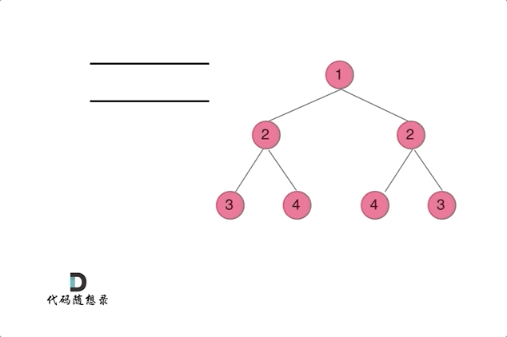

# [101. 对称二叉树](https://leetcode-cn.com/problems/symmetric-tree/)

给你一个二叉树的根节点 `root` ， 检查它是否轴对称。

**示例 1：**


```
输入：root = [1,2,2,3,4,4,3]
输出：true
```

**示例 2：**


```
输入：root = [1,2,2,null,3,null,3]
输出：false
```

**提示：**

- 树中节点数目在范围 `[1, 1000]` 内
- `-100 <= Node.val <= 100`

**进阶：**你可以运用递归和迭代两种方法解决这个问题吗？

### 递归法


- **比较外侧是否对称：传入左节点的左孩子，右节点的右孩子。**
- **比较内侧是否对称：传入左节点的右孩子，右节点的左孩子。**
- **如果左右都对称就返回 true ，有一侧不对称就返回 false 。**

```c++
class Solution {
public:
    bool compare(TreeNode* left, TreeNode* right) {
        if (left && !right) return false;
        else if (right && !left) return false;
        else if (!right && !left) return true;
        else if (right->val != left->val) return false;
        //简洁写法
        //if (!left && !right) return true;
        //else if (!left || !right || left->val != right->val) return false;
        //体会这内外两侧在递归中实现的效果
        return compare(left->left, right->right) 
            && compare(left->right, right->left);
    }
    bool isSymmetric(TreeNode* root) {
        if (!root) return true;
        return compare(root->left, root->right);
    }
};
```

### 迭代法



**通过队列来判断根节点的左子树和右子树的内侧和外侧是否相等。**

**将队列直接改成栈亦可。push 的顺序也不用更改，只需保证内外侧两对是依次压入即可。**

```c++
class Solution {
public:
    bool isSymmetric(TreeNode* root) {
        //stack<TreeNode*> st;
        queue<TreeNode*> que;
        que.push(root->left);
        que.push(root->right);
        while (!que.empty()) {
            //TreeNode* leftNode = st.top();
            TreeNode* lNode = que.front();
            que.pop();
            TreeNode* rNode = que.front();
            que.pop();
            if (!lNode && !rNode) continue;
            if (!lNode || !rNode || lNode->val != rNode->val)
                return false;
            //st.push(leftNode->left);
            que.push(lNode->left);
            que.push(rNode->right);
            que.push(lNode->right);
            que.push(rNode->left);
        }
        return true;
    }
};
```

