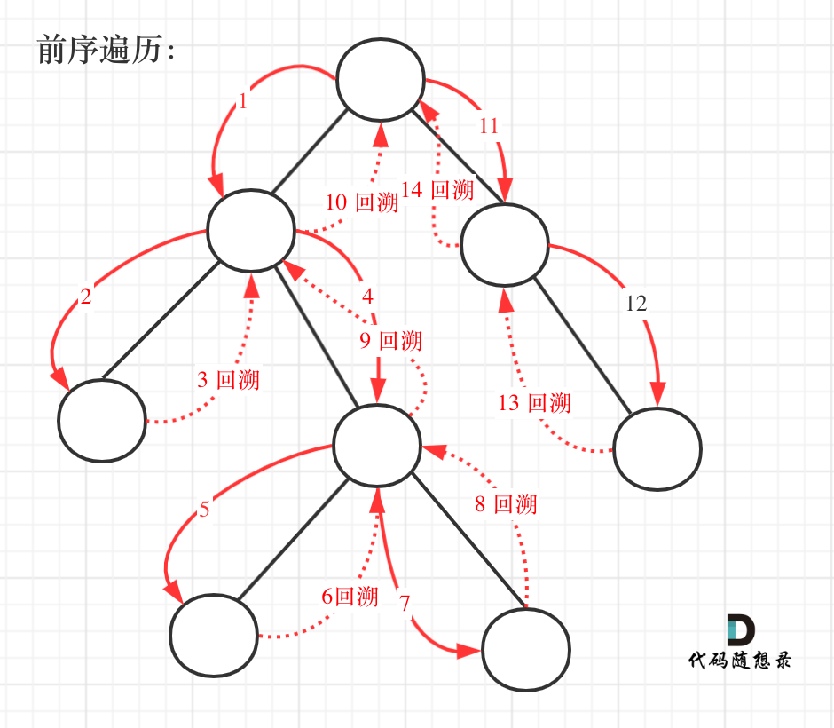

# [257. 二叉树的所有路径](https://leetcode-cn.com/problems/binary-tree-paths/)

**5-11二刷，二叉树的递归回溯**

给你一个二叉树的根节点 `root` ，按 **任意顺序** ，返回所有从根节点到叶子节点的路径。

**叶子节点** 是指没有子节点的节点。

**示例 1：**


```
输入：root = [1,2,3,null,5]
输出：["1->2->5","1->3"]
```

**示例 2：**

```
输入：root = [1]
输出：["1"]
```

**提示：**

- 树中节点的数目在范围 `[1, 100]` 内
- `-100 <= Node.val <= 100`

### 递归回溯



```c++
class Solution {
public: //注意函数参数要不要加引用 & 的问题，经常忘记
    void traversal(TreeNode* root, vector<int>& path, vector<string>& result) {
        path.push_back(root->val);
        //找到叶子节点就开始处理结束的逻辑
        if (root->left == nullptr && root->right == nullptr) {
            string str;
            for (int i = 0; i < path.size() - 1; i++) {
                str += to_string(path[i]);
                str += "->";
            }
            str += to_string(path[path.size() - 1]);
            result.push_back(str);
            return; //结束本路径
        }
        if (root->left != nullptr) {
            traversal(root->left, path, result);
            path.pop_back(); //递归跟回溯不分开
        }
        if (root->right != nullptr) {
            traversal(root->right, path, result);
            path.pop_back();
        }
    }
    vector<string> binaryTreePaths(TreeNode* root) {
        vector<int> path;
        vector<string> result;
        if (root == nullptr) return result;
        traversal(root, path, result);
        return result;
    }
};
```

### 精简版

**注意函数定义** `void traversal(TreeNode* cur, string path, vector<string>& result)` 。

**定义的是**`string path`**，每次都是复制赋值，不使用引用，否则就无法做到回溯的效果。**

**回溯就隐藏在**`traversal(cur->left, path + "->", result);`**中的** `path + "->"`。 

**每次函数调用完，path 依然是没有加上 "->" 的，这就是回溯了。**

```c++
class Solution {
public:
    void traversal(TreeNode* root, string path, vector<string>& result) {
        path += to_string(root->val);
        if (root->left == nullptr && root->right == nullptr) {
            result.push_back(path);
            return;
        }
        //注意这里第二个参数不是 path += "->"，否则向右走时会出现重复的 ""
        if (root->left != nullptr) traversal(root->left, path + "->", result);
        if (root->right != nullptr) traversal(root->right, path + "->", result);
    }
    vector<string> binaryTreePaths(TreeNode* root) {
        string path;
        vector<string> result;
        if (root == nullptr) return result;
        traversal(root, path, result);
        return result;
    }
};
```

@笨猪爆破组

如果有人问你，前中后序遍历的区别是什么？他可能不希望你回答根左右之类的，他希望你抓住实质，他会继续问你为什么。

而且如果你回答：中序遍历是先访问左子树，再访问根节点。可能会觉得你人云亦云，or没想明白，or表述模糊。

中序遍历也是先访问根节点，再左子树，再右子树，只是将 do something with root（对节点进行处理）放在访问完左子树之后。

因为 DFS 遍历，每个节点有 3 次不同的驻留阶段，在其中一个时间点拿当前节点做事，就分别对应前中后遍历，如下图。

> Preorder, Postorder and Inorder are all based on DFS.
> The only difference is:
> During the traversal, **what time they will access the content of a node.**
> Because **a node is actually visited 3 times for binary tree**. They include: the time before the first DFS call, and the times after each DFS call.

