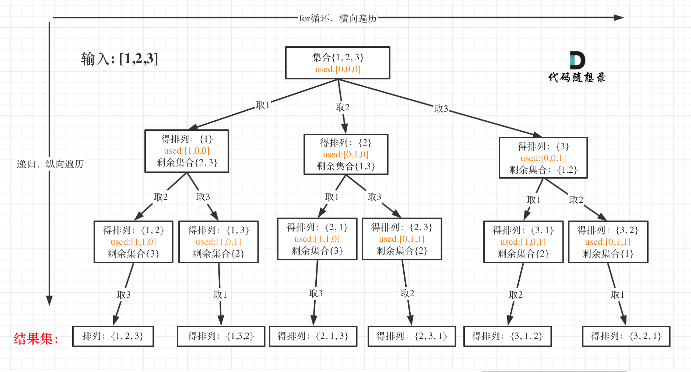

# [46. 全排列](https://leetcode-cn.com/problems/permutations/)

**6-6二刷**

给定一个不含重复数字的数组 `nums` ，返回其 *所有可能的全排列* 。你可以 **按任意顺序** 返回答案。

**示例 1：**

```
输入：nums = [1,2,3]
输出：[[1,2,3],[1,3,2],[2,1,3],[2,3,1],[3,1,2],[3,2,1]]
```

**示例 2：**

```
输入：nums = [0,1]
输出：[[0,1],[1,0]]
```

**示例 3：**

```
输入：nums = [1]
输出：[[1]]
```

**提示：**

- `1 <= nums.length <= 6`
- `-10 <= nums[i] <= 10`
- `nums` 中的所有整数 **互不相同**

### 回溯



```c++
//自主AC，思路参考上一题，使用了数组记录用过的元素并回溯
class Solution {
public:
    vector<vector<int>> result;
    vector<int> path;
    int n[21] = {0};
    void backTracking(vector<int>& nums) {
        if (path.size() == nums.size()) {
            result.push_back(path);
            return;
        }
        for (int i = 0; i < nums.size(); i++) {
            if (n[nums[i] + 10] == 1) continue;
            n[nums[i] + 10] = 1;
            path.push_back(nums[i]);
            backTracking(nums);
            n[nums[i] + 10] = 0;
            path.pop_back();
        }
    }
    vector<vector<int>> permute(vector<int>& nums) {
        backTracking(nums);
        return result;
    }
};
```

```c++
//Carl版，大同小异，使用vector<bool>记录
class Solution {
public:
    vector<vector<int>> result;
    vector<int> path;
    void backTracking(vector<int>& nums, vector<bool>& used) {
        if (path.size() == nums.size()) {
            result.push_back(path);
            return;
        }
        for (int i = 0; i < nums.size(); i++) {
            if (used[i]) continue;
            used[i] = true;
            path.push_back(nums[i]);
            backTracking(nums, used);
            path.pop_back();
            used[i] = false;
        }
    }
    vector<vector<int>> permute(vector<int>& nums) {
        vector<bool> used(nums.size(), false);
        backTracking(nums, used);
        return result;
    }
};
```

