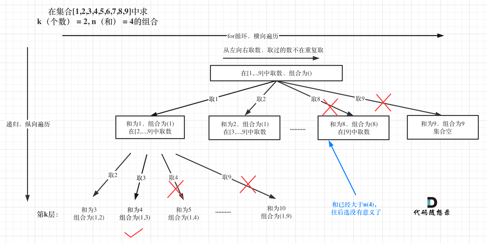

# [216. 组合总和 III](https://leetcode-cn.com/problems/combination-sum-iii/)

**6-5二刷**

找出所有相加之和为 ***n*** 的 ***k*** 个数的组合。组合中只允许含有 1 - 9 的正整数，并且每种组合中不存在重复的数字。

**说明：**

- 所有数字都是正整数。
- 解集不能包含重复的组合。 

**示例 1:**

```
输入: k = 3, n = 7
输出: [[1,2,4]]
```

**示例 2:**

```
输入: k = 3, n = 9
输出: [[1,2,6], [1,3,5], [2,3,4]]
```

### 回溯

**思路与上一题一样，只不过加入了求和的判断，递归终止条件相应改变。**



```c++
class Solution {
public:
    vector<vector<int>> resutl;
    vector<int> path;
    void backTracking(int k, int n, int startIndex) {
        if (n < 0) return; //组合总和大于 n ,可以直接终止了，也实现
        if (path.size() == k) {
            if (n == 0) { //满足组合总和为 n
                resutl.push_back(path);
                return;
            }
  
            return;
        }
        for (int i = startIndex; i < 10 - (k - path.size()) + 1; i++) { //剪枝
            path.push_back(i); //处理当前节点
            backTracking(k, n - i, i + 1); //递归
            path.pop_back(); //回溯
        }
    }
    vector<vector<int>> combinationSum3(int k, int n) {
        backTracking(k, n, 1);
        return resutl;
    }
};
```

