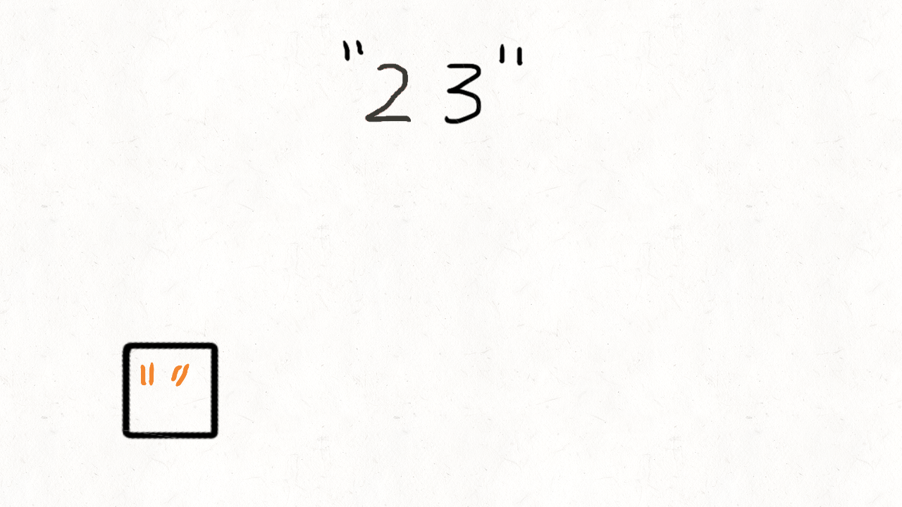

# [17. 电话号码的字母组合](https://leetcode-cn.com/problems/letter-combinations-of-a-phone-number/)

**6-5二刷**

给定一个仅包含数字 `2-9` 的字符串，返回所有它能表示的字母组合。答案可以按 **任意顺序** 返回。

给出数字到字母的映射如下（与电话按键相同）。注意 1 不对应任何字母。


**示例 1：**

```
输入：digits = "23"
输出：["ad","ae","af","bd","be","bf","cd","ce","cf"]
```

**示例 2：**

```
输入：digits = ""
输出：[]
```

**示例 3：**

```
输入：digits = "2"
输出：["a","b","c"]
```

**提示：**

- `0 <= digits.length <= 4`
- `digits[i]` 是范围 `['2', '9']` 的一个数字。

### 回溯

- **定义一个二维数组来建立数字与字母的映射(map 亦可)**
- **借用参数 index 来寻找对应的字母集**
- **使用 for 循环来依次处理当前字母集**
- **集合中字母的数量决定了树的宽度，输入数字的数量决定了树的深度**


```c++
class Solution {
public:
    string letterMap[10] = { //数字与字母集的映射
    "", // 0
    "", // 1
    "abc", // 2
    "def", // 3
    "ghi", // 4
    "jkl", // 5
    "mno", // 6
    "pqrs", // 7
    "tuv", // 8
    "wxyz", // 9
    };
    vector<string> result;
    string s;
    void backTracking(string digits, int index) {
        if (index == digits.size()) { //终止条件：已经处理完所有数字 （index 从 0 开始）
            result.push_back(s);
            return;
        }
        int num = digits[index] - '0'; //转化为数字对应的int
        string letter = letterMap[num]; //获取对应的字母集
        for (int i = 0; i < letter.size(); i++) { //按顺序处理字母
            s.push_back(letter[i]); //处理
            backTracking(digits, index + 1); //递归，处理下一个数字，index + 1
            s.pop_back(); //回溯
        }
    }
    vector<string> letterCombinations(string digits) {
        if (digits.size() == 0) return result;
        backTracking(digits, 0);
        return result;
    }
};
```

### 队列



```c++
class Solution {
public:
    string letterMap[10] = {
    "", // 0
    "", // 1
    "abc", // 2
    "def", // 3
    "ghi", // 4
    "jkl", // 5
    "mno", // 6
    "pqrs", // 7
    "tuv", // 8
    "wxyz", // 9
    };
    vector<string> letterCombinations(string digits) {
        vector<string> result;
        if (digits.size() == 0) return result;
        queue<string> que;
        que.push(""); //先向队列里加入一个空字符，这样可以统一处理逻辑
        for (int i = 0; i < digits.size(); i++) { //根据数字数量
            int size = que.size(); //当前队列中的元素数量
            for (int j = 0; j < size; j++) {
                string s = que.front(); //获取队头字符
                que.pop(); //弹出队头
                int num = digits[i] - '0'; //将当前数字字符转化为 int 型
                for (int k = 0; k < letterMap[num].size(); k++) { //根据字母集数量
                    que.push(s + letterMap[num][k]); //队头字符加上当前字母重新入队
                    if (i == digits.size() - 1) //到达组合元素上限就加入结果集
                    result.push_back(s + letterMap[num][k]);
                }
            }
        }
        return result;
    }
};
```

