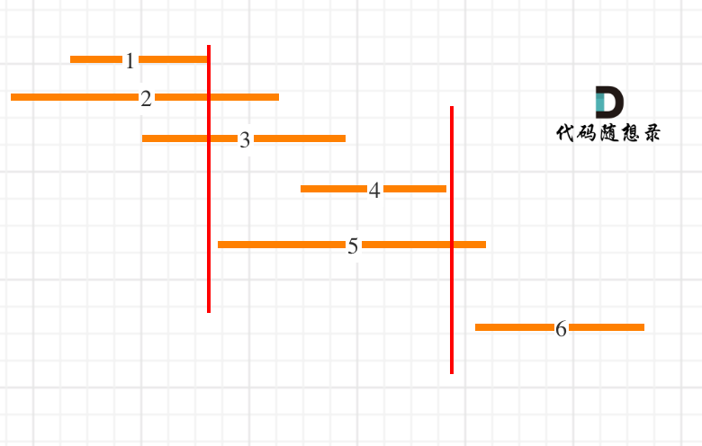

# [435. 无重叠区间](https://leetcode-cn.com/problems/non-overlapping-intervals/)

**6-10二刷**

给定一个区间的集合 `intervals` ，其中 `intervals[i] = [starti, endi]` 。返回 *需要移除区间的最小数量，使剩余区间互不重叠* 。

**示例 1:**

```
输入: intervals = [[1,2],[2,3],[3,4],[1,3]]
输出: 1
解释: 移除 [1,3] 后，剩下的区间没有重叠。
```

**示例 2:**

```
输入: intervals = [ [1,2], [1,2], [1,2] ]
输出: 2
解释: 你需要移除两个 [1,2] 来使剩下的区间没有重叠。
```

**示例 3:**

```
输入: intervals = [ [1,2], [2,3] ]
输出: 0
解释: 你不需要移除任何区间，因为它们已经是无重叠的了。
```

**提示:**

- `1 <= intervals.length <= 105`
- `intervals[i].length == 2`
- `-5 * 104 <= starti < endi <= 5 * 104`

### 贪心算法

- **按照右边界排序**
  - **为什么按右边界排序？ 如果我们把本题的区间看成是会议，那么按照右端点排序，我们一定能够找到一个最先结束的会议，而这个会议一定是我们需要添加到最终结果的的首个会议，这样能够给后面预留的时间更长。**

- **最后返回总数减去非交叉数**
- **难点**
  - **怎么排序？按左边界排还是右边界排。**
  - **排完序之后如何遍历？**
  - **直接求重复的区间是复杂的，转而求最大非重复区间个数。**
  - **求最大非重复区间个数时，需要一个分割点来做标记。**



```c++
class Solution {
public:
    int eraseOverlapIntervals(vector<vector<int>>& intervals) {
        if (intervals.size() == 0) return 0;
        //按右边界进行排序
        sort(intervals.begin(), intervals.end(), 
             [](vector<int>& a, vector<int>& b) {
                return a[1] < b[1];
        	 });
        int count = 1;
        //以第一个点的右边界为分割点
        int end = intervals[0][1];
        for (int i = 1; i < intervals.size(); i++) {
            //如果不重叠
            if (intervals[i][0] >= end) {
                ++count;
                end = intervals[i][1]; //以其右边界为新的分割点
            }
        }
        return intervals.size() - count;
    }
};
```

```c++
// 二刷
class Solution {
public:
    int eraseOverlapIntervals(vector<vector<int>>& intervals) {
        if (intervals.size() == 1) return 0;
        sort(intervals.begin(), intervals.end(), [](vector<int>& a, vector<int>& b) {
            return a[1] < b[1];
        });
        int result = 0;
        int start = intervals[0][0];
        int end = intervals[0][1];
        for (int i = 1; i < intervals.size(); i++) {
            if (intervals[i][0] < end) {
                result++;
            } else {
                start = intervals[i][0];
                end = intervals[i][1];
            }
        }
        return result;
    }
};
```

