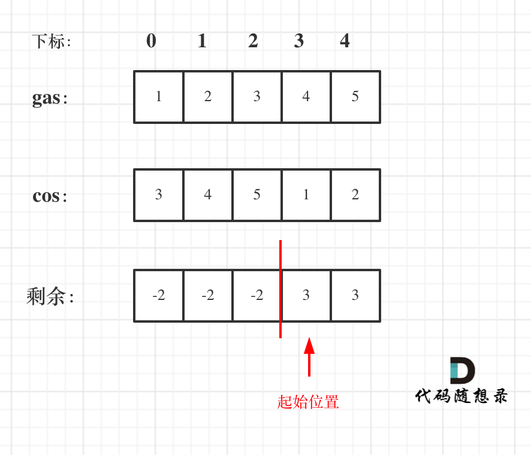

# [134. 加油站](https://leetcode-cn.com/problems/gas-station/)

**6-9二刷**

在一条环路上有 `n` 个加油站，其中第 `i` 个加油站有汽油 `gas[i]` 升。

你有一辆油箱容量无限的的汽车，从第 `i` 个加油站开往第 `i+1` 个加油站需要消耗汽油 `cost[i]` 升。你从其中的一个加油站出发，开始时油箱为空。

给定两个整数数组 `gas` 和 `cost` ，如果你可以绕环路行驶一周，则返回出发时加油站的编号，否则返回 `-1` 。如果存在解，则 **保证** 它是 **唯一** 的。

**示例 1:**

```
输入: gas = [1,2,3,4,5], cost = [3,4,5,1,2]
输出: 3
解释:
从 3 号加油站(索引为 3 处)出发，可获得 4 升汽油。此时油箱有 = 0 + 4 = 4 升汽油
开往 4 号加油站，此时油箱有 4 - 1 + 5 = 8 升汽油
开往 0 号加油站，此时油箱有 8 - 2 + 1 = 7 升汽油
开往 1 号加油站，此时油箱有 7 - 3 + 2 = 6 升汽油
开往 2 号加油站，此时油箱有 6 - 4 + 3 = 5 升汽油
开往 3 号加油站，你需要消耗 5 升汽油，正好足够你返回到 3 号加油站。
因此，3 可为起始索引。
```

**示例 2:**

```
输入: gas = [2,3,4], cost = [3,4,3]
输出: -1
解释:
你不能从 0 号或 1 号加油站出发，因为没有足够的汽油可以让你行驶到下一个加油站。
我们从 2 号加油站出发，可以获得 4 升汽油。 此时油箱有 = 0 + 4 = 4 升汽油
开往 0 号加油站，此时油箱有 4 - 3 + 2 = 3 升汽油
开往 1 号加油站，此时油箱有 3 - 3 + 3 = 3 升汽油
你无法返回 2 号加油站，因为返程需要消耗 4 升汽油，但是你的油箱只有 3 升汽油。
因此，无论怎样，你都不可能绕环路行驶一周。
```

**提示:**

- `gas.length == n`
- `cost.length == n`
- `1 <= n <= 105`
- `0 <= gas[i], cost[i] <= 104`

### 贪心算法

- **如果总油量减去总消耗大于 0 说明一定可以跑完一圈**
- **将整体划分为局部 [0, i]**
- **计算 curSum，如果 curSum < 0 说明在此区间内不论从哪个位置出发一定不能跑完一圈，那么起始位置直接从 i + 1 (start) 开始，重置 curSum = 0，区间重新划分为 [start , i]**
- **最后检验 totalSum**



```c++
class Solution {
public:
    int canCompleteCircuit(vector<int>& gas, vector<int>& cost) {
        int curSum = 0;
        int totalSum = 0;
        int start = 0;
        for (int i = 0; i < gas.size(); i++) {
            curSum += (gas[i] - cost[i]);
            totalSum += (gas[i] - cost[i]);
            if (curSum < 0) { //如果当前区间内总和小于零，无论从那里出发都不行
                start = i + 1;
                curSum = 0;
            }
        }
        if (totalSum < 0) return -1;
        return start;
    }
};
```

```c++
// 二刷
class Solution {
public:
    int canCompleteCircuit(vector<int>& gas, vector<int>& cost) {
        int gasSum = 0;
        int curGas = 0;
        int costSum = 0;
        int startIdx = 0;
        for (int i = 0; i < gas.size(); i++) {
            gasSum += gas[i];
            costSum += cost[i];
            curGas += gas[i];
            if (curGas < cost[i]) {
                startIdx = i + 1;
                curGas = 0;
            } else {
                curGas -= cost[i];
            }
        }
        if (costSum > gasSum) return -1;
        return startIdx;
    }
};
```

### 暴力模拟

```c++
//最后一个用例超时
class Solution {
public:
    int canCompleteCircuit(vector<int>& gas, vector<int>& cost) {
        for (int i = 0; i < cost.size(); i++) {
            int rest = gas[i] - cost[i]; // 记录剩余油量
            int index = (i + 1) % cost.size();
            while (rest > 0 && index != i) { // 模拟以i为起点行驶一圈
                rest += gas[index] - cost[index];
                index = (index + 1) % cost.size();
            }
            // 如果以i为起点跑一圈，剩余油量>=0，返回该起始位置
            if (rest >= 0 && index == i) return i;
        }
        return -1;
    }
};
```

