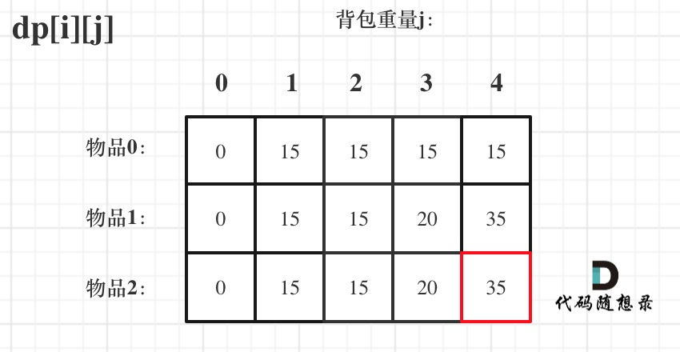

# 0-1背包理论基础

有 n 件物品和一个最多能背重量为 w 的背包。第i件物品的重量是 weight[i]，得到的价值是 value[i] 。**每件物品只能用一次**，求解将哪些物品装入背包里物品价值总和最大。


这是标准的背包问题，以至于很多同学看了这个自然就会想到背包，甚至都不知道暴力的解法应该怎么解了。

这样其实是没有从底向上去思考，而是习惯性想到了背包，那么暴力的解法应该是怎么样的呢？

每一件物品其实只有两个状态，取或者不取，所以可以使用回溯法搜索出所有的情况，那么时间复杂度就是$O(2^n)$，这里的 n 表示物品数量。

**所以暴力的解法是指数级别的时间复杂度。进而才需要动态规划的解法来进行优化！**

背包最大重量为4。

|       | 重量 | 价值 |
| ----- | ---- | ---- |
| 物品0 | 1    | 15   |
| 物品1 | 3    | 20   |
| 物品2 | 4    | 30   |

问背包能背的物品最大价值是多少？

## 二维 dp 数组0-1背包

#### 1.确定dp数组以及下标的含义

对于背包问题，有一种写法， 是使用二维数组，即**dp[i] [j] 表示从下标为[0-i]的物品里任意取，放进容量为j的背包，价值总和最大是多少**。


**要时刻记着这个dp数组的含义，下面的一些步骤都围绕这dp数组的含义进行的**，如果哪里看懵了，就来回顾一下i代表什么，j又代表什么。

#### 2.确定递推公式

再回顾一下dp[i] [j]的含义：从下标为[0-i]的物品里任意取，放进容量为j的背包，价值总和最大是多少。

那么可以有两个方向推出来dp[i] [j]，

- **不放物品i**：由dp[i - 1] [j]推出，即背包容量为j，里面不放物品i的最大价值，此时dp[i][j]就是dp[i - 1] [j]。(其实就是当物品i的重量大于背包j的重量时，物品i无法放进背包中，所以被背包内的价值依然和前面相同。)
- **放物品i**：由dp[i - 1] [j - weight[i]]推出，dp[i - 1] [j - weight[i]] 为背包容量为j - weight[i]的时候不放物品i的最大价值，那么dp[i - 1] [j - weight[i]] + value[i] （物品i的价值），就是背包放物品i得到的最大价值

递归公式： **dp[i] [j] = max(dp[i - 1] [j], dp[i - 1] [j - weight[i]] + value[i]);**

#### 3.dp数组初始化

**关于初始化，一定要和dp数组的定义吻合，否则到递推公式的时候就会越来越乱**。


```c++
// 初始化 dp
vector<vector<int>> dp(weight.size(), vector<int>(bagweight + 1, 0));
for (int j = weight[0]; j <= bagweight; j++) {
    dp[0][j] = value[0];
}
```

#### 4.确定遍历顺序

在如下图中，可以看出，有两个遍历的维度：物品与背包重量


那么问题来了，**先遍历物品还是先遍历背包重量呢？**

**其实都可以！！ 但是先遍历物品更好理解**。

```c++
// weight数组的大小 就是物品个数
for(int i = 1; i < weight.size(); i++) { // 遍历物品
    for(int j = 0; j <= bagweight; j++) { // 遍历背包容量
        if (j < weight[i]) dp[i][j] = dp[i - 1][j]; 
        else dp[i][j] = max(dp[i - 1][j], dp[i - 1][j - weight[i]] + value[i]);

    }
}
```


**其实背包问题里，两个for循环的先后循序是非常有讲究的，理解遍历顺序其实比理解推导公式难多了**。

#### 5.举例推导dp数组

来看一下对应的dp数组的数值，如图：



最终结果就是dp [2] [4]。

建议大家此时自己在纸上推导一遍，看看dp数组里每一个数值是不是这样的。

**做动态规划的题目，最好的过程就是自己在纸上举一个例子把对应的dp数组的数值推导一下，然后在动手写代码！**

很多同学做dp题目，遇到各种问题，然后凭感觉东改改西改改，怎么改都不对，或者稀里糊涂就改过了。

主要就是自己没有动手推导一下dp数组的演变过程，如果推导明白了，代码写出来就算有问题，只要把dp数组打印出来，对比一下和自己推导的有什么差异，很快就可以发现问题了。

### 完整代码

```cpp
void test_2_wei_bag_problem1() {
    vector<int> weight = {1, 3, 4};
    vector<int> value = {15, 20, 30};
    int bagweight = 4;

    // 初始化
    vector<vector<int>> dp(weight.size(), vector<int>(bagweight + 1, 0));
    for (int j = weight[0]; j <= bagweight; j++) {
        dp[0][j] = value[0];
    }

    // weight数组的大小 就是物品个数
    for(int i = 1; i < weight.size(); i++) { // 遍历物品
        for(int j = 0; j <= bagweight; j++) { // 遍历背包容量
            if (j < weight[i]) dp[i][j] = dp[i - 1][j];
            else dp[i][j] = max(dp[i - 1][j], dp[i - 1][j - weight[i]] + value[i]);
        }
    }

    cout << dp[weight.size() - 1][bagweight] << endl;
}
```

## 一维 dp 数组（滚动数组）

在使用二维数组的时候，递推公式：dp[i] [j] = max(dp[i - 1] [j], dp[i - 1] [j - weight[i]] + value[i]);

**其实可以发现如果把dp[i - 1]那一层拷贝到dp[i]上，表达式完全可以是：dp[i] [j] = max(dp[i] [j], dp[i] [j - weight[i]] + value[i]);**

**与其把dp[i - 1]这一层拷贝到dp[i]上，不如只用一个一维数组了**，只用dp[j]（一维数组，也可以理解是一个滚动数组）。

这就是滚动数组的由来，需要满足的条件是上一层可以重复利用，直接拷贝到当前层。

#### 1.确定dp数组的定义

在一维dp数组中，dp[j]表示：容量为j的背包，所背的物品价值可以最大为dp[j]。

#### 2.一维dp数组的递推公式

dp[j]为容量为 j 的背包所背的最大价值，那么如何推导dp[j]呢？

dp[j]可以通过dp[j - weight[i]]推导出来，dp[j - weight[i]]表示容量为j - weight[i]的背包所背的最大价值。

dp[j - weight[i]] + value[i] 表示 容量为 j - 物品i重量 的背包 加上 物品i的价值。（也就是容量为j的背包，放入物品i了之后的价值即：dp[j]）

此时dp[j]有两个选择，一个是取自己dp[j] 相当于 二维dp数组中的dp[i-1] [j]，即不放物品i，一个是取dp[j - weight[i]] + value[i]，即放物品i，指定是取最大的，毕竟是求最大价值，

所以递归公式为：

```text
dp[j] = max(dp[j], dp[j - weight[i]] + value[i]);
```

可以看出相对于二维dp数组的写法，就是把dp[i] [j]中i的维度去掉了。

#### 3.一维dp数组如何初始化

**关于初始化，一定要和dp数组的定义吻合，否则到递推公式的时候就会越来越乱**。

dp[j]表示：容量为j的背包，所背的物品价值可以最大为dp[j]，那么dp[0]就应该是0，因为背包容量为0所背的物品的最大价值就是0。

那么dp数组除了下标0的位置，初始为0，其他下标应该初始化多少呢？

看一下递归公式：dp[j] = max(dp[j], dp[j - weight[i]] + value[i]);

dp数组在推导的时候一定是取价值最大的数，如果题目给的价值都是正整数那么非0下标都初始化为0就可以了。

**这样才能让dp数组在递归公式的过程中取的最大的价值，而不是被初始值覆盖了**。

那么我假设物品价值都是大于0的，所以dp数组初始化的时候，都初始为0就可以了。

#### 4.一维dp数组遍历顺序

```text
for(int i = 0; i < weight.size(); i++) { // 遍历物品
    for(int j = bagWeight; j >= weight[i]; j--) { // 遍历背包容量
        dp[j] = max(dp[j], dp[j - weight[i]] + value[i]);
    }
}
```

**这里大家发现和二维dp的写法中，遍历背包的顺序是不一样的！**

二维dp遍历的时候，背包容量是从小到大，而一维dp遍历的时候，背包是从大到小。

为什么呢？

**倒序遍历是为了保证物品i只被放入一次！**。但如果一旦正序遍历了，那么物品0就会被重复加入多次！

举一个例子：物品0的重量weight[0] = 1，价值value[0] = 15，如果正序遍历

dp[1] = dp[1 - weight[0]] + value[0] = 15

dp[2] = dp[2 - weight[0]] + value[0] = 30

此时dp[2]就已经是30了，意味着物品0，被放入了两次，所以不能正序遍历。

为什么倒序遍历，就可以保证物品只放入一次呢？

倒序就是先算dp[2]

dp[2] = dp[2 - weight[0]] + value[0] = 15 （dp数组已经都初始化为0）

dp[1] = dp[1 - weight[0]] + value[0] = 15

所以从后往前循环，每次取得状态不会和之前取得状态重合，这样每种物品就只取一次了。

**那么问题又来了，为什么二维dp数组历的时候不用倒序呢？**

因为对于二维dp，dp[i] [j]都是通过上一层即dp[i - 1] [j]计算而来，本层的dp[i] [j]并不会被覆盖！

（如何这里读不懂，大家就要动手试一试了，空想还是不靠谱的，实践出真知！）

**再来看看两个嵌套for循环的顺序，代码中是先遍历物品嵌套遍历背包容量，那可不可以先遍历背包容量嵌套遍历物品呢？**

不可以！

因为一维dp的写法，背包容量一定是要倒序遍历（原因上面已经讲了），如果遍历背包容量放在上一层，那么每个dp[j]就只会放入一个物品，即：背包里只放入了一个物品。

（这里如果读不懂，就在回想一下dp[j]的定义，或者就把两个for循环顺序颠倒一下试试！）

**所以一维dp数组的背包在遍历顺序上和二维其实是有很大差异的！**，这一点大家一定要注意。

#### 5.举例推导dp数组


### 完整测试代码

```cpp
void test_1_wei_bag_problem() {
    vector<int> weight = {1, 3, 4};
    vector<int> value = {15, 20, 30};
    int bagWeight = 4;

    // 初始化
    vector<int> dp(bagWeight + 1, 0);
    
    for(int i = 0; i < weight.size(); i++) { // 遍历物品
        for(int j = bagWeight; j >= weight[i]; j--) { // 遍历背包容量
            dp[j] = max(dp[j], dp[j - weight[i]] + value[i]);
        }
    }
    
    cout << dp[bagWeight] << endl;
}
```

可以看出，一维要比二维简洁的多！初始化和遍历顺序相对简单了。

**所以我倾向于使用一维dp数组的写法，比较直观简洁，而且空间复杂度还降了一个数量级！**