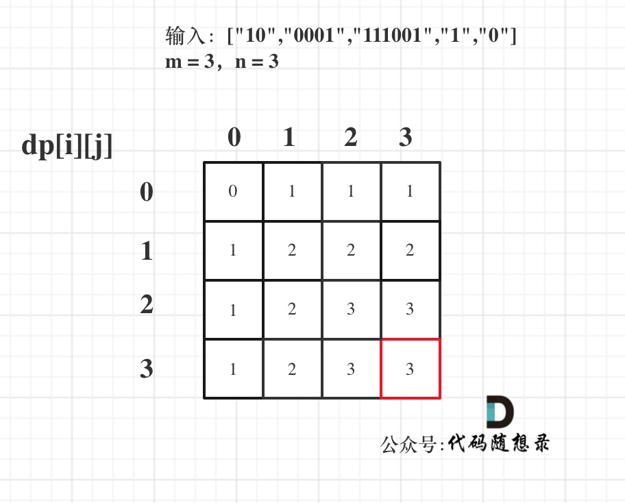

# [474. 一和零](https://leetcode-cn.com/problems/ones-and-zeroes/)

**6-17二刷**

给你一个二进制字符串数组 `strs` 和两个整数 `m` 和 `n` 。

请你找出并返回 `strs` 的最大子集的长度，该子集中 **最多** 有 `m` 个 `0` 和 `n` 个 `1` 。

如果 `x` 的所有元素也是 `y` 的元素，集合 `x` 是集合 `y` 的 **子集** 。

**示例 1：**

```
输入：strs = ["10", "0001", "111001", "1", "0"], m = 5, n = 3
输出：4
解释：最多有 5 个 0 和 3 个 1 的最大子集是 {"10","0001","1","0"} ，因此答案是 4 。
其他满足题意但较小的子集包括 {"0001","1"} 和 {"10","1","0"} 。{"111001"} 不满足题意，因为它含 4 个 1 ，大于 n 的值 3 。
```

**示例 2：**

```
输入：strs = ["10", "0", "1"], m = 1, n = 1
输出：2
解释：最大的子集是 {"0", "1"} ，所以答案是 2 。
```

**提示：**

- `1 <= strs.length <= 600`
- `1 <= strs[i].length <= 100`
- `strs[i]` 仅由 `'0'` 和 `'1'` 组成
- `1 <= m, n <= 100`

### 0-1 背包

*本题并不是多重背包，下图捋清几种背包的关系：*


**本题中 strs 数组里的元素就是物品，每个物品都是 0 和 1 的选择！而 m 和 n 相当于是一个两维的背包。**

**确定dp数组以及下标的含义dp[i] [j]：最多有 i 个 0 和 j 个 1 的 strs 的最大子集的大小。**



```c++
class Solution {
public:
    int findMaxForm(vector<string>& strs, int m, int n) {
        vector<vector<int>> dp(m + 1, vector<int>(n + 1, 0));
        for (string str : strs) {
            int count0 = 0, count1 = 0;
            for (char c : str) {
                if (c == '0') ++count0;
                else ++count1;
            }
            for (int i = m; i >= count0; i--)
                for (int j = n; j >= count1; j--)
                    dp[i][j] = max(dp[i][j], dp[i - count0][j - count1] + 1);
        }
        return dp[m][n];
    }
};
```

