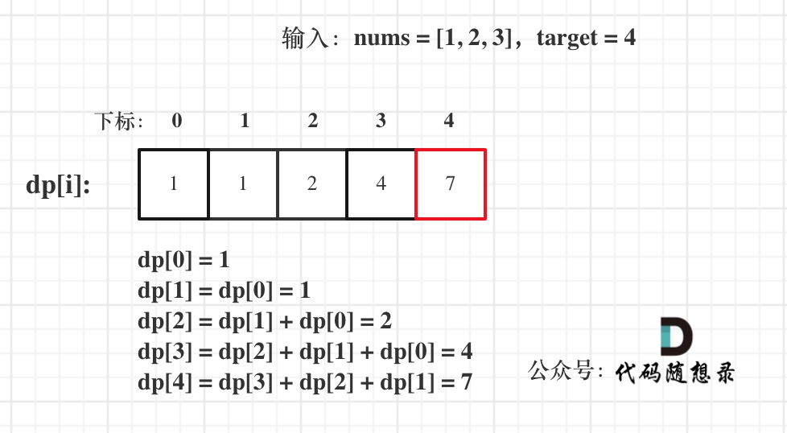

# [377. 组合总和 Ⅳ](https://leetcode-cn.com/problems/combination-sum-iv/)

**6-18二刷，注意到如果物品在外循环，就永远不会出现{3，1}这种情况，所以物品应在内循环。**

给你一个由 **不同** 整数组成的数组 `nums` ，和一个目标整数 `target` 。请你从 `nums` 中找出并返回总和为 `target` 的元素组合的个数。

题目数据保证答案符合 32 位整数范围。

**示例 1：**

```
输入：nums = [1,2,3], target = 4
输出：7
解释：
所有可能的组合为：
(1, 1, 1, 1)
(1, 1, 2)
(1, 2, 1)
(1, 3)
(2, 1, 1)
(2, 2)
(3, 1)
请注意，顺序不同的序列被视作不同的组合。
```

**示例 2：**

```
输入：nums = [9], target = 3
输出：0
```

**提示：**

- `1 <= nums.length <= 200`
- `1 <= nums[i] <= 1000`
- `nums` 中的所有元素 **互不相同**
- `1 <= target <= 1000`

**进阶：**如果给定的数组中含有负数会发生什么？问题会产生何种变化？如果允许负数出现，需要向题目中添加哪些限制条件？

### 完全背包

- **确定dp数组以及下标的含义**

**dp[i]: 凑成目标正整数为 i 的排列个数为 dp[i]**

- **确定递推公式**

**dp[j] += dp[j - nums[i]];**

- **dp数组如何初始化**

**dp[0] 初始化为 1**

- **确定遍历顺序**

**个数可以不限使用，说明这是一个完全背包。**

**得到的集合是排列，说明需要考虑元素之间的顺序。**

**本题要求的是排列，那么这个for循环嵌套的顺序可以有说法了。**

**如果求组合数就是外层for循环遍历物品，内层for遍历背包。**

**如果求排列数就是外层for遍历背包，内层for循环遍历物品。**

***如果把遍历 nums（物品）放在外循环，遍历 target 的作为内循环的话，举一个例子：计算 dp[4] 的时候，结果集只有 {1,3} 这样的集合，不会有 {3,1} 这样的集合，因为 nums 遍历放在外层，3 只能出现在 1 后面！***

**所以本题遍历顺序最终遍历顺序：target（背包）放在外循环，将nums（物品）放在内循环，内循环从前到后遍历。**

- **举例来推导dp数组**



```c++
class Solution {
public:
    int combinationSum4(vector<int>& nums, int target) {
        vector<int> dp(target + 1, 0);
        dp[0] = 1;
        for (int j = 0; j <= target; j++)
            for (int i = 0; i < nums.size(); i++)
                // nums[i] <= j 表示能放得下
                // dp[j] < INT_MAX - dp[j - nums[i]] 防止相加后溢出
                if (nums[i] <= j && dp[j] < INT_MAX - dp[j - nums[i]]) 
                    dp[j] += dp[j - nums[i]];
        return dp[target];
    }
};
```

