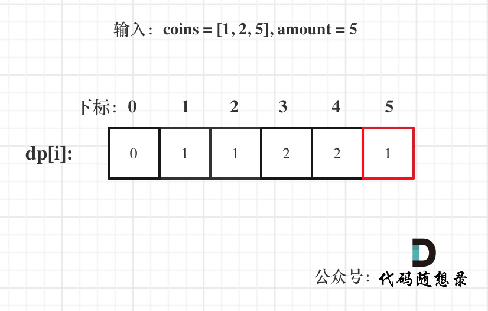

# [322. 零钱兑换](https://leetcode-cn.com/problems/coin-change/)

**6-18二刷**

给你一个整数数组 `coins` ，表示不同面额的硬币；以及一个整数 `amount` ，表示总金额。

计算并返回可以凑成总金额所需的 **最少的硬币个数** 。如果没有任何一种硬币组合能组成总金额，返回 `-1` 。

你可以认为每种硬币的数量是无限的。

**示例 1**

```
输入：coins = [1, 2, 5], amount = 11
输出：3 
解释：11 = 5 + 5 + 1
```

**示例 2：**

```
输入：coins = [2], amount = 3
输出：-1
```

**示例 3：**

```
输入：coins = [1], amount = 0
输出：0
```

**提示：**

- `1 <= coins.length <= 12`
- `1 <= coins[i] <= 231 - 1`
- `0 <= amount <= 104`

### 完全背包

- 确定dp数组以及下标的含义

**dp[j]：凑足总额为j所需钱币的最少个数为 dp[j]。**

- 确定递推公式

得到 dp[j]（考虑coins[i]），只有一个来源，dp[j - coins[i]]（没有考虑 coins[i]）。

凑足总额为 j - coins[i] 的最少个数为 dp[j - coins[i]]，那么只需要加上一个钱币 coins[i] 即 dp[j - coins[i]] + 1就是 dp[j]（考虑coins[i]），所以dp[j] 要取所有 dp[j - coins[i]] + 1 中最小的。

递推公式：dp[j] = min(dp[j - coins[i]] + 1, dp[j]);

- dp数组如何初始化

首先凑足总金额为0所需钱币的个数一定是0，那么dp[0] = 0;

其他下标对应的数值呢？考虑到递推公式的特性，dp[j]必须初始化为一个最大的数，否则就会在min(dp[j - coins[i]] + 1, dp[j])比较的过程中被初始值覆盖。

所以下标非0的元素都是应该是整型 int 的最大值。

- 举例推导dp数组

输入：coins = [1, 2, 5], amount = 5



```c++
// 没有完全靠自己 AC , 因为没有处理好 dp 数组的初始化问题（设为了 0 ），但思路是正确的
class Solution {
public:
    int coinChange(vector<int>& coins, int amount) {
        vector<int> dp(amount + 1, INT_MAX);
        dp[0] = 0;
        for (int i = 0; i < coins.size(); i++) 
            for (int j = coins[i]; j <= amount; j++) 
                // 如果是初始值就直接跳过（说明不能凑到 j - coins[i] 的钱）
                // 例如输入：coins = [2], amount = 3
                // 只有 dp[0] dp[2] 能被凑成，dp[1]、dp[3] 是初始值
                if (dp[j - coins[i]] != INT_MAX)
                    // 要求最少的硬币个数，使用 min() 所以 dp 数组不能初始化为 0
                   	// 否则就会永远是 0 了，比较过程中会一直被初始值 0 覆盖
                    dp[j] = min(dp[j - coins[i]] + 1, dp[j]);
        if (dp[amount] == INT_MAX) return -1;
        return dp[amount];
    }
};
```

