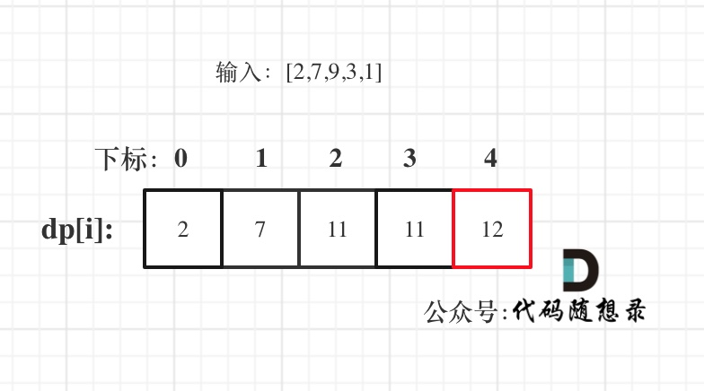

# [198. 打家劫舍](https://leetcode-cn.com/problems/house-robber/)

**6-19二刷**

你是一个专业的小偷，计划偷窃沿街的房屋。每间房内都藏有一定的现金，影响你偷窃的唯一制约因素就是相邻的房屋装有相互连通的防盗系统，**如果两间相邻的房屋在同一晚上被小偷闯入，系统会自动报警**。

给定一个代表每个房屋存放金额的非负整数数组，计算你 **不触动警报装置的情况下** ，一夜之内能够偷窃到的最高金额。

**示例 1：**

```
输入：[1,2,3,1]
输出：4
解释：偷窃 1 号房屋 (金额 = 1) ，然后偷窃 3 号房屋 (金额 = 3)。
     偷窃到的最高金额 = 1 + 3 = 4 。
```

**示例 2：**

```
输入：[2,7,9,3,1]
输出：12
解释：偷窃 1 号房屋 (金额 = 2), 偷窃 3 号房屋 (金额 = 9)，接着偷窃 5 号房屋 (金额 = 1)。
     偷窃到的最高金额 = 2 + 9 + 1 = 12 。
```

**提示：**

- `1 <= nums.length <= 100`
- `0 <= nums[i] <= 400`

### 动态规划

- **确定 dp 数组以及下标的含义**

**dp[i]：考虑下标i（包括i）以内的房屋，最多可以偷窃的金额为dp[i]。**

- **确定递推公式**

**决定 dp[i] 的因素就是第 i 房间偷还是不偷。**

**如果偷第 i 房间，那么 dp[i] = dp[i - 2] + nums[i] ，即：第 i-1 房一定是不考虑的，找出下标 i-2（包括i-2）以内的房屋，最多可以偷窃的金额为 dp[i-2] 加上第 i 房间偷到的钱。**

**如果不偷第i房间，那么 dp[i] = dp[i - 1]，即考虑 i-1 房。**

**然后 dp[i] 取最大值，即 dp[i] = max(dp[i - 2] + nums[i], dp[i - 1]);**

- **dp数组初始化**

**递推公式的基础就是dp[0] 和 dp[1]，dp[0] 一定是 nums[0]，dp[1]是nums[0]和nums[1]的最大值即。**



```c++
class Solution {
public:
    int rob(vector<int>& nums) {
        if (nums.size() == 1) return nums[0];
        vector<int> dp(nums.size(), 0); 
        dp[0] = nums[0];
        dp[1] = max(nums[0], nums[1]);
        for (int i = 2; i < nums.size(); i++) { // 按顺序一次遍历即可
                dp[i] = max(dp[i - 1], dp[i - 2] + nums[i]);
        }
        return dp[nums.size() - 1];
    }
};
```

```c++
// 自己写的狗屎代码！不一定非要两次遍历啊！
class Solution {
public:
    int rob(vector<int>& nums) {
        vector<int> dp(nums.size() + 1, 0); 
        for (int j = 1; j <= nums.size(); j++) {
            // 下面两个其实都是 dp 数组初始化，可以在循环外就完成
            if (j == 1) {
                dp[j] = nums[0]; continue;
            }
            if (j == 2) {
                dp[j] = max(nums[0], nums[1]); continue;
            }
            // 先遍历背包，再遍历物品
            // 但实际到 j + 1 时，从 i = 2 到 j 的遍历根本没有意义
            // 因为这部分根本没有改变过，只需要考虑新加入的 nums[j+1] 就够了
            for (int i = 2; i < j; i++) 
                dp[j] = max(dp[j - 1], dp[j - 2] + nums[i]);
        }
        return dp[nums.size()];
    }
};
```

