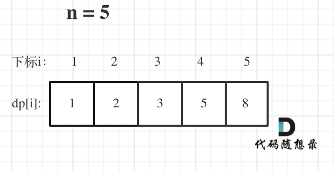

# [70. 爬楼梯](https://leetcode-cn.com/problems/climbing-stairs/)

**6-15二刷**

假设你正在爬楼梯。需要 `n` 阶你才能到达楼顶。

每次你可以爬 `1` 或 `2` 个台阶。你有多少种不同的方法可以爬到楼顶呢？

**示例 1：**

```
输入：n = 2
输出：2
解释：有两种方法可以爬到楼顶。
1. 1 阶 + 1 阶
2. 2 阶
```

**示例 2：**

```
输入：n = 3
输出：3
解释：有三种方法可以爬到楼顶。
1. 1 阶 + 1 阶 + 1 阶
2. 1 阶 + 2 阶
3. 2 阶 + 1 阶
```

**提示：**

- `1 <= n <= 45`

### 动态规划

1. **确定 dp 数组以及下标的含义**

   **dp[i]： 爬到第i层楼梯，有 dp[i] 种方法**

2. **确定递推公式**

   **上 i-1 层楼梯，有 dp[i - 1] 种方法，再跳一个台阶就是 dp[i] ；上 i-2 层楼梯，有 dp[i - 2] 种方法，那么再跳两个台阶就是 dp[i] 。那么 dp[i] 就是 dp[i - 1]与dp[i - 2]之和！所以dp[i] = dp[i - 1] + dp[i - 2] 。**

3. **dp 数组如何初始化**

   **在回顾一下dp[i]的定义：爬到第i层楼梯，有dp[i]中方法。dp[1] = 1，dp[2] = 2，然后从i = 3开始递推，这样才符合dp[i]的定义。**

4. **确定遍历顺序**

   **从递推公式dp[i] = dp[i - 1] + dp[i - 2];中可以看出，遍历顺序一定是从前向后遍历的**

5. **举例推导dp数组**

   **举例当n为5的时候，dp table（dp数组）应该是这样的**



```c++
class Solution {
public:
    int climbStairs(int n) {
        if (n <= 2) return n;
        vector<int> dp(n + 1);
        dp[1] = 1;
        dp[2] = 2;
        for (int i = 3; i <= n; i++) {
            dp[i] = dp[i-1] + dp[i-2];
        }
        return dp[n];
    }
};
```

```c++
// 优化空间复杂度
class Solution {
public:
    int climbStairs(int n) {
        if (n <= 1) return n;
        int dp[3];
        dp[1] = 1;
        dp[2] = 2;
        for (int i = 3; i <= n; i++) {
            int sum = dp[1] + dp[2];
            dp[1] = dp[2];
            dp[2] = sum;
        }
        return dp[2];
    }
};
```

