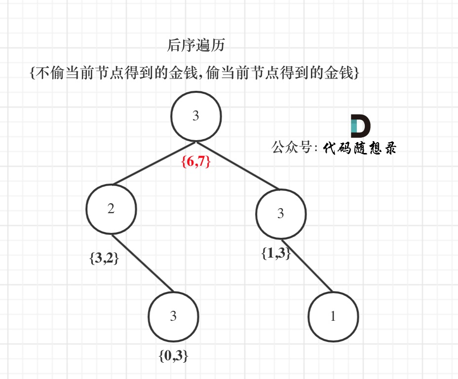

# [337. 打家劫舍 III](https://leetcode-cn.com/problems/house-robber-iii/)

**6-20二刷**

小偷又发现了一个新的可行窃的地区。这个地区只有一个入口，我们称之为 `root` 。

除了 `root` 之外，每栋房子有且只有一个“父“房子与之相连。一番侦察之后，聪明的小偷意识到“这个地方的所有房屋的排列类似于一棵二叉树”。 如果 **两个直接相连的房子在同一天晚上被打劫** ，房屋将自动报警。

给定二叉树的 `root` 。返回 ***在不触动警报的情况下** ，小偷能够盗取的最高金额* 。

**示例 1:**


```
输入: root = [3,2,3,null,3,null,1]
输出: 7 
解释: 小偷一晚能够盗取的最高金额 3 + 3 + 1 = 7
```

**示例 2:**


```
输入: root = [3,4,5,1,3,null,1]
输出: 9
解释: 小偷一晚能够盗取的最高金额 4 + 5 = 9
```

**提示：**

- 树的节点数在 `[1, 104]` 范围内
- `0 <= Node.val <= 104`

### 树形动态规划

- **确定递归函数的参数和返回值**

**参数为当前节点，返回值是 dp 数组。**

**dp 数组及下标含义:下标为 0 记录不偷该节点所得到的最大金钱，下标为 1 记录偷该节点所得到的最大金钱。**

- **确定终止条件**

**在遍历的过程中，如果遇到空节点的话，很明显，无论偷还是不偷都是 0，所以就返回。这也相当于dp数组的初始化。**

- **确定遍历顺序**

**首先明确的是使用后序遍历。 因为通过递归函数的返回值来做下一步计算。**

**通过递归左节点，得到左节点偷与不偷的金钱。**

**通过递归右节点，得到右节点偷与不偷的金钱。**

- **确定单层递归的逻辑**

**如果是偷当前节点，那么左右孩子就不能偷，val1 = cur->val + left[0] + right[0];** 

**如果不偷当前节点，那么左右孩子就可以偷，而且一定是选一个最大的，所以：val2 = max(left[0], left[1]) + max(right[0], right[1]);**

**最后当前节点的状态就是{val2, val1};**

- **举例推导dp数组**



```c++
class Solution {
public:
    int rob(TreeNode* root) {
        vector<int> result = robTree(root);
        return max(result[0], result[1]);
    }
    vector<int> robTree(TreeNode* cur) {
        if (cur == nullptr) return {0, 0};
        vector<int> left = robTree(cur->left);
        vector<int> right = robTree(cur->right);
        int val0 = max(left[0], left[1]) + max(right[0], right[1]);
        int val1 = cur->val + left[0] + right[0];
        return {val0, val1};
    }
};
```

**相当有意思的一道动态规划！其实看了答案之后发现思路并不复杂，相当简洁清晰。难点在于如何将二叉树的后序遍历和 dp 数组结合在一起：使用了 dp 数组来作为递归函数的返回值，dp[0] 表示不偷当前节点的最大金额，dp[1] 表示偷当前节点的最大金额，根据偷与不偷来更新本次递归的 dp 数组（如果偷，那么就将当前节点值与两个孩子节点的不偷值相加，如果不偷，那么就分别选择两个孩子节点的最优值）。**