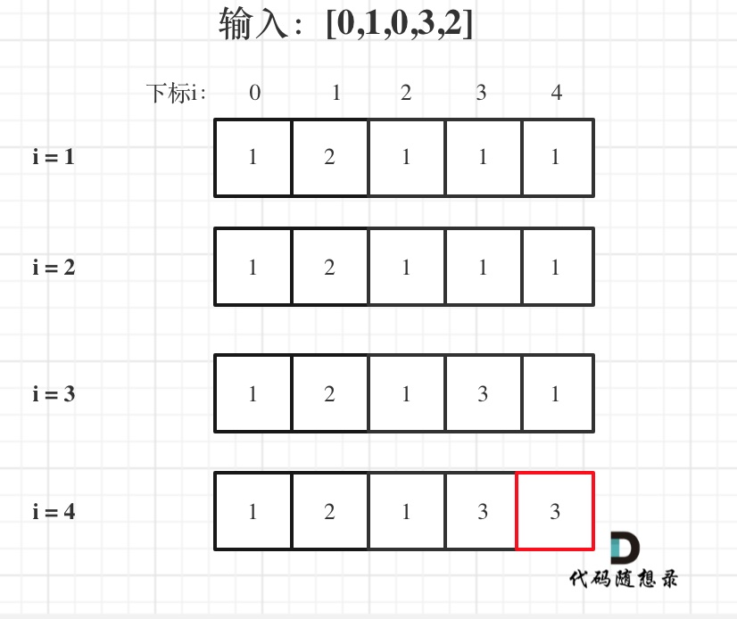

# [300. 最长递增子序列](https://leetcode-cn.com/problems/longest-increasing-subsequence/)

**6-22二刷**

给你一个整数数组 `nums` ，找到其中最长严格递增子序列的长度。

**子序列** 是由数组派生而来的序列，删除（或不删除）数组中的元素而不改变其余元素的顺序。例如，`[3,6,2,7]` 是数组 `[0,3,1,6,2,2,7]` 的子序列。

**示例 1：**

```
输入：nums = [10,9,2,5,3,7,101,18]
输出：4
解释：最长递增子序列是 [2,3,7,101]，因此长度为 4 。
```

**示例 2：**

```
输入：nums = [0,1,0,3,2,3]
输出：4
```

**示例 3：**

```
输入：nums = [7,7,7,7,7,7,7]
输出：1
```

**提示：**

- `1 <= nums.length <= 2500`
- `-104 <= nums[i] <= 104`

**进阶：**

- 你能将算法的时间复杂度降低到 `O(n log(n))` 吗?

### 动态规划

**思路：**

- **顺序遍历数组 nums[i]，**
  - **循环顺序遍历 i 之前的数字 nums[j]，**
    - **如果大于其中一个： nums[i] > nums[j]，可以在其基础上加一： dp[i] = max(dp[i], dp[j] + 1)。**



```c++
// 比较简单，但是竟然没做出来，想复杂了，自己用了个二维动态数组
class Solution {
public:
    int lengthOfLIS(vector<int>& nums) {
        int n = nums.size();
        if (n == 1) return 1;
        vector<int> dp(n, 1);
        int result = 0;
        for (int i = 1; i < n; i++) {
            for (int j = 0; j < i; j++)
                if (nums[i] > nums[j]) dp[i] = max(dp[i], dp[j] + 1);
            if (dp[i] > result) result = dp[i];
        }
        return result;
    }
};
```

