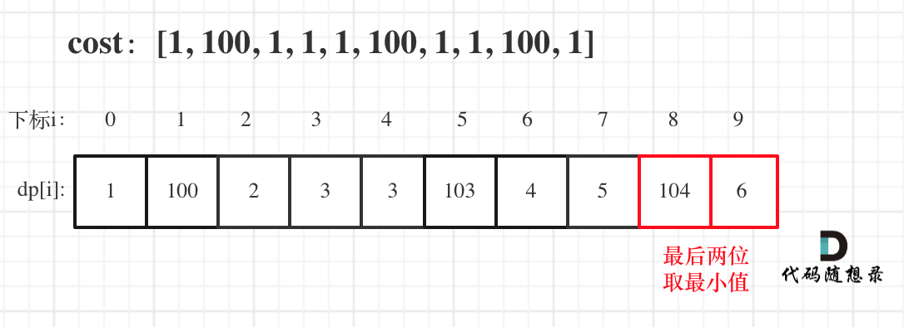

# [746. 使用最小花费爬楼梯](https://leetcode-cn.com/problems/min-cost-climbing-stairs/)

**6-15二刷**

给你一个整数数组 `cost` ，其中 `cost[i]` 是从楼梯第 `i` 个台阶向上爬需要支付的费用。一旦你支付此费用，即可选择向上爬一个或者两个台阶。

你可以选择从下标为 `0` 或下标为 `1` 的台阶开始爬楼梯。

请你计算并返回达到楼梯顶部的最低花费。

**示例 1：**

```
输入：cost = [10,15,20]
输出：15
解释：你将从下标为 1 的台阶开始。
- 支付 15 ，向上爬两个台阶，到达楼梯顶部。
总花费为 15 。
```

**示例 2：**

```
输入：cost = [1,100,1,1,1,100,1,1,100,1]
输出：6
解释：你将从下标为 0 的台阶开始。
- 支付 1 ，向上爬两个台阶，到达下标为 2 的台阶。
- 支付 1 ，向上爬两个台阶，到达下标为 4 的台阶。
- 支付 1 ，向上爬两个台阶，到达下标为 6 的台阶。
- 支付 1 ，向上爬一个台阶，到达下标为 7 的台阶。
- 支付 1 ，向上爬两个台阶，到达下标为 9 的台阶。
- 支付 1 ，向上爬一个台阶，到达楼梯顶部。
总花费为 6 。
```

**提示：**

- `2 <= cost.length <= 1000`
- `0 <= cost[i] <= 999`

### 动态规划

1. **确定dp数组以及下标的含义**

   **dp[i]的定义：到达第i个台阶所花费的最少体力为dp[i]。（注意这里认为是第一步一定是要花费）**

2. **确定递推公式**

   **可以有两个途径得到dp[i]，一个是dp[i-1] 一个是dp[i-2]。那么究竟是选dp[i-1]还是dp[i-2]呢？一定是选最小的，所以dp[i] = min(dp[i - 1], dp[i - 2]) + cost[i]；注意这里为什么是加cost[i]，而不是cost[i-1],cost[i-2]之类的，因为题目中说了：每当你爬上一个阶梯你都要花费对应的体力值**

3. **dp数组如何初始化**

   **只初始化dp[0]和dp[1]就够了，其他的最终都是dp[0]dp[1]推出。所以初始化代码为：**

   ```text
   vector<int> dp(cost.size());
   dp[0] = cost[0];
   dp[1] = cost[1];
   ```

4. **确定遍历顺序**

   **dp[i] 由 dp[i-1] 和 dp[i-2] 推出，所以是从前到后遍历。**

5. **举例推导dp数组**

   **示例2：cost = [1, 100, 1, 1, 1, 100, 1, 1, 100, 1] ，来模拟一下dp数组的状态变化，如下：**



```cpp
class Solution {
public:
    int minCostClimbingStairs(vector<int>& cost) {
        vector<int> dp(cost.size());
        dp[0] = cost[0];
        dp[1] = cost[1];
        for (int i = 2; i < cost.size(); i++) {
            dp[i] = min(dp[i - 1], dp[i - 2]) + cost[i];
        }
        // 注意最后一步可以理解为不用花费，所以取倒数第一步，第二步的最少值
        return min(dp[cost.size() - 1], dp[cost.size() - 2]);
    }
};
```

```cpp
// 甚至不需要数组
class Solution {
public:
    int minCostClimbingStairs(vector<int>& cost) {
        int dp0 = cost[0];
        int dp1 = cost[1];
        for (int i = 2; i < cost.size(); i++) {
            int dpi = min(dp0, dp1) + cost[i];
            dp0 = dp1; // 记录一下前两位
            dp1 = dpi;
        }
        return min(dp0, dp1);
    }
};
```