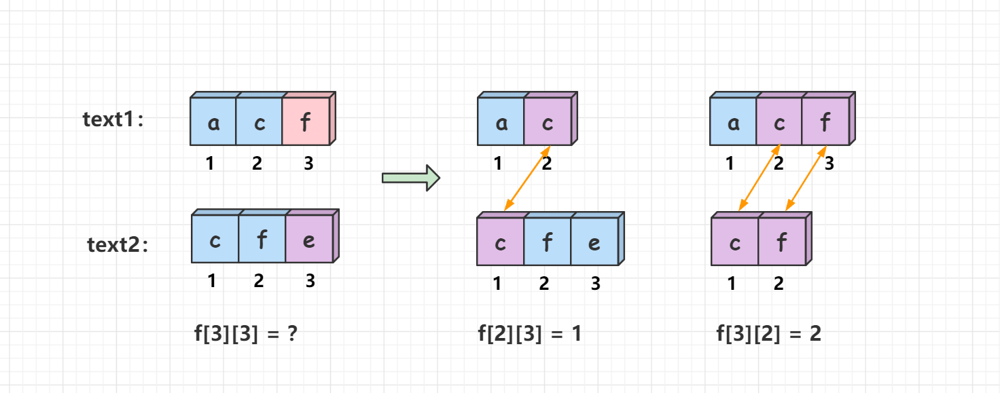
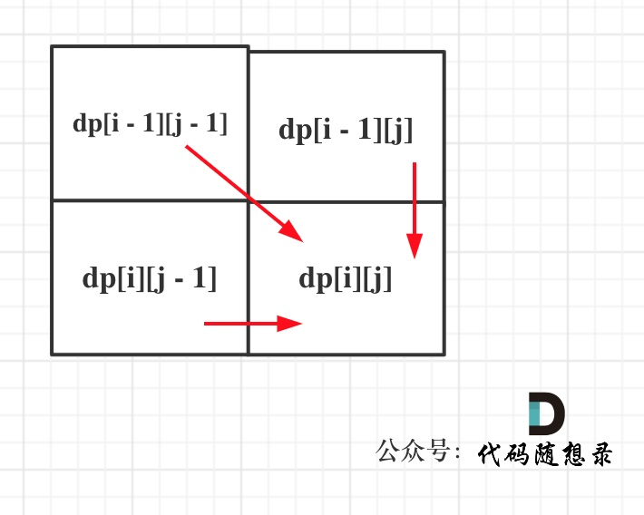

# [1143. 最长公共子序列](https://leetcode-cn.com/problems/longest-common-subsequence/)

**6-22二刷**

给定两个字符串 `text1` 和 `text2`，返回这两个字符串的最长 **公共子序列** 的长度。如果不存在 **公共子序列** ，返回 `0` 。

一个字符串的 **子序列** 是指这样一个新的字符串：它是由原字符串在不改变字符的相对顺序的情况下删除某些字符（也可以不删除任何字符）后组成的新字符串。

- 例如，`"ace"` 是 `"abcde"` 的子序列，但 `"aec"` 不是 `"abcde"` 的子序列。

两个字符串的 **公共子序列** 是这两个字符串所共同拥有的子序列。

**示例 1：**

```
输入：text1 = "abcde", text2 = "ace" 
输出：3  
解释：最长公共子序列是 "ace" ，它的长度为 3 。
```

**示例 2：**

```
输入：text1 = "abc", text2 = "abc"
输出：3
解释：最长公共子序列是 "abc" ，它的长度为 3 。
```

**示例 3：**

```
输入：text1 = "abc", text2 = "def"
输出：0
解释：两个字符串没有公共子序列，返回 0 。
```

**提示：**

- `1 <= text1.length, text2.length <= 1000`
- `text1` 和 `text2` 仅由小写英文字符组成。

### 动态规划

- **确定dp数组（dp table）以及下标的含义**

**dp[i] [j]：长度为[0, i - 1]的字符串text1与长度为[0, j - 1]的字符串text2的最长公共子序列为dp[i] [j]**

- **确定递推公式**

  - **主要就是两大情况： text1[i - 1] 与 text2[j - 1]相同，text1[i - 1] 与 text2[j - 1]不相同**

    - **如果text1[i - 1] 与 text2[j - 1]相同，那么找到了一个公共元素，所以dp[i] [j] = dp[i - 1] [j - 1] + 1;**

    - **如果 text1[i - 1] 与 text2[j - 1]不相同，那就看看 text1[0, i - 2] 与 text2[0, j - 1]的最长公共子序列和  text1[0, i - 1]与 text2[0, j - 2]的最长公共子序列，取最大的。**
    
    - **举个例子，比如对于 ace 和 bc 而言，他们的最长公共子序列的长度等于 ace 和 b 的最长公共子序列长度0 与 ac 和 bc 的最长公共子序列长度1 的最大值，即 1。**
    
      

- **确定遍历顺序**

**从递推公式可以看出，有三个方向可以推出dp[i] [j]：**



**那么为了在递推的过程中，这三个方向都是经过计算的数值，所以要从前向后，从上到下来遍历这个矩阵。**

- **举例推导dp数组**

**输入：text1 = "abcde", text2 = "ace" ，dp状态如图：**


```c++
class Solution {
public:
    int longestCommonSubsequence(string text1, string text2) {
        int n = text1.size();
        int m = text2.size();
        vector<vector<int>> dp(n + 1, vector<int>(m + 1, 0));
        // 下标从1开始是因为dp依赖于上一层的状态，防止越界
        for (int i = 1; i <= n; i++) {
            for (int j = 1; j <= m; j++) {
                if (text1[i - 1] == text2[j - 1])
                    dp[i][j] = dp[i - 1][j - 1] + 1;
                else
                    dp[i][j] = max(dp[i - 1][j], dp[i][j - 1]);
            }
        }
        return dp[n][m];
    }
};
```

