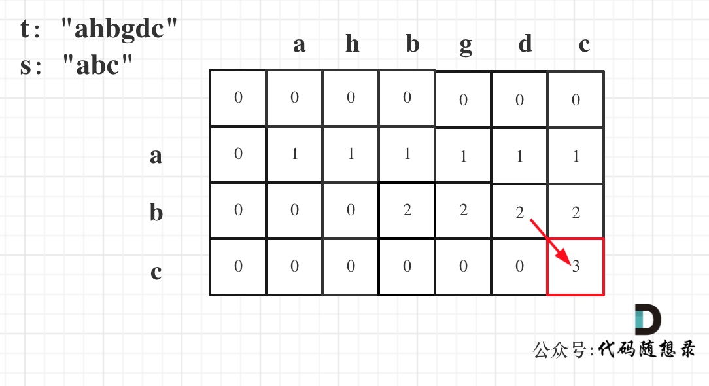

# [392. 判断子序列](https://leetcode-cn.com/problems/is-subsequence/)

**6-22二刷**

给定字符串 **s** 和 **t** ，判断 **s** 是否为 **t** 的子序列。

字符串的一个子序列是原始字符串删除一些（也可以不删除）字符而不改变剩余字符相对位置形成的新字符串。（例如，`"ace"`是`"abcde"`的一个子序列，而`"aec"`不是）。

**进阶：**

如果有大量输入的 S，称作 S1, S2, ... , Sk 其中 k >= 10亿，你需要依次检查它们是否为 T 的子序列。在这种情况下，你会怎样改变代码？

**致谢：**

特别感谢 [@pbrother ](https://leetcode.com/pbrother/)添加此问题并且创建所有测试用例。

**示例 1：**

```
输入：s = "abc", t = "ahbgdc"
输出：true
```

**示例 2：**

```
输入：s = "axc", t = "ahbgdc"
输出：false
```

**提示：**

- `0 <= s.length <= 100`
- `0 <= t.length <= 10^4`
- 两个字符串都只由小写字符组成。

### 动态规划

- **确定 dp 数组以及下标的含义**

**dp[i] [j] 表示以下标i-1为结尾的字符串s，和以下标j-1为结尾的字符串t，相同子序列的长度为dp[i] [j]。**

- **确定递推公式**

**在确定递推公式的时候，首先要考虑如下两种操作：**

**if (s[i - 1] == t[j - 1])	t中找到了一个字符在s中也出现了，那么dp[i] [j] = dp[i - 1] [j - 1] + 1;，因为找到了一个相同的字符，相同子序列长度自然要在dp[i-1] [j-1]的基础上加1。**

**if (s[i - 1] != t[j - 1])	相当于t要删除元素，继续匹配，t如果把当前元素t[j - 1]删除，那么dp[i] [j] 的数值就是 看s[i - 1]与 t[j - 2]的比较结果了，即：dp[i] [j] = dp[i] [j - 1];**

- **举例推导dp数组**

**输入：s = "abc", t = "ahbgdc"，dp 状态转移图如下：**



```c++
class Solution {
public:
    bool isSubsequence(string s, string t) {
        int n = s.size();
        int m = t.size();
        vector<vector<int>> dp(n + 1, vector<int>(m + 1, 0));
        for (int i = 1; i <= n; i++) {
            for (int j = 1; j <= m; j++) {
                if (s[i - 1] == t[j - 1]) 
                    dp[i][j] = dp[i - 1][j - 1] + 1;
                else 
                    // dp[i][j] = max(dp[i - ][j], dp[i][j - 1]) 也可以
                    // dp[i][j - 1] 相当于删除了一个 t 的字符
                    dp[i][j] = dp[i][j - 1];
        return n == dp[n][m];
    }
};
```

