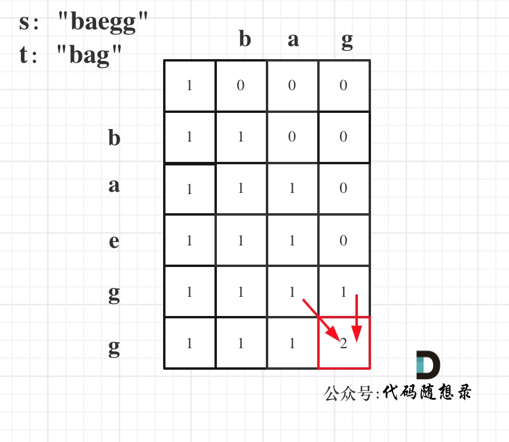

# [115. 不同的子序列](https://leetcode-cn.com/problems/distinct-subsequences/)

给定一个字符串 `s` 和一个字符串 `t` ，计算在 `s` 的子序列中 `t` 出现的个数。

字符串的一个 **子序列** 是指，通过删除一些（也可以不删除）字符且不干扰剩余字符相对位置所组成的新字符串。（例如，`"ACE"` 是 `"ABCDE"` 的一个子序列，而 `"AEC"` 不是）

题目数据保证答案符合 32 位带符号整数范围。

**示例 1：**

```
输入：s = "rabbbit", t = "rabbit"
输出：3
解释：
如下图所示, 有 3 种可以从 s 中得到 "rabbit" 的方案。
rabbbit
rabbbit
rabbbit
```

**示例 2：**

```
输入：s = "babgbag", t = "bag"
输出：5
解释：
如下图所示, 有 5 种可以从 s 中得到 "bag" 的方案。 
babgbag
babgbag
babgbag
babgbag
babgbag
```

**提示：**

- `0 <= s.length, t.length <= 1000`
- `s` 和 `t` 由英文字母组成

### 动态规划

- **确定 dp 数组以及下标的含义**

**dp[i] [j]：以 i-1 为结尾的 s 子序列中出现以 j-1 为结尾的 t 的个数为 dp[i] [j]。**

- **确定递推公式**

  - **s[i - 1] 与 t[j - 1]相等**

  - **s[i - 1] 与 t[j - 1] 不相等**

**当s[i - 1] 与 t[j - 1]相等时，dp[i] [j]可以有两部分组成。**

**一部分是用 s[i - 1] 来匹配，那么个数为 dp[i - 1] [j - 1]。一部分是不用 s[i - 1] 来匹配，个数为 dp[i - 1] [j]。**

**例如： s：bagg 和 t：bag ，s[3] 和 t[2]是相同的，但是字符串s也可以不用s[3]来匹配，即用s[0]s[1]s[2]组成的bag。当然也可以用s[3]来匹配，即：s[0]s[1]s[3]组成的bag。**

**所以当s[i - 1] 与 t[j - 1]相等时，dp[i] [j] = dp[i - 1] [j - 1] + dp[i - 1] [j];**

**当s[i - 1] 与 t[j - 1]不相等时，dp[i] [j]只有一部分组成，不用s[i - 1]来匹配，所以递推公式为：dp[i] [j] = dp[i - 1] [j];**

- **dp数组如何初始化**

**从递推公式dp[i] [j] = dp[i - 1] [j - 1] + dp[i - 1] [j]; 和 dp[i] [j] = dp[i - 1] [j]; 中可以看出dp[i] [0] 和dp[0] [j]是一定要初始化的。**

**每次当初始化的时候，都要回顾一下dp[i][j]的定义，不要凭感觉初始化。**

**dp[i] [0] 表示：以i-1为结尾的s可以随便删除元素，出现空字符串的个数。**

**那么dp[i] [0]一定都是1，因为也就是把以i-1为结尾的s，删除所有元素，出现空字符串的个数就是1。**

**再来看dp[0] [j]：空字符串s可以随便删除元素，出现以j-1为结尾的字符串t的个数。**

**那么dp[0] [j]一定都是0，s如论如何也变成不了t。**

**最后就要看一个特殊位置了，即：dp[0] [0] 应该是多少。**

**dp[0] [0]应该是1，空字符串s，可以删除0个元素，变成空字符串t。**

- **确定遍历顺序**

**遍历的时候一定是从上到下，从左到右，这样保证dp[i] [j]可以根据之前计算出来的数值进行计算。**

- **举例推导dp数组**

**s："baegg"，t："bag"为例，推导dp数组状态如下：**



```c++
// 在 /usr/include/stdint.h 中有定义
// 目的：方便代码维护，涉及跨平台，不同得平台有不同的字长
// typedef unsigned long int	uint64_t;  
class Solution {
public:
    int numDistinct(string s, string t) {
        int n = s.size();
        int m = t.size();
        // <int> 的话在最后的测试用例会溢出
        vector<vector<uint64_t>> dp(n + 1, vector<uint64_t>(m + 1, 0));
        // dp 数组的初始化
        // dp[0][i] 相当于 s 中只有空字符去匹配 t[i-1]，当然为 0
        for (int i = 1; i <= m; i++) dp[0][i] = 0;
        // dp[i][0] 相当于 s[i-1] 中去匹配 t 中仅有的空字符，s 可以删除至空，所以为 1
        for (int i = 0; i <= n; i++) dp[i][0] = 1;
        for (int i = 1; i <= n; i++)
            for (int j = 1; j <= m; j++)
                if (s[i - 1] == t[j - 1])
                    dp[i][j] = dp[i - 1][j - 1] + dp[i - 1][j];
                else
                    dp[i][j] = dp[i - 1][j];
        return dp[n][m];
    }
};
```

