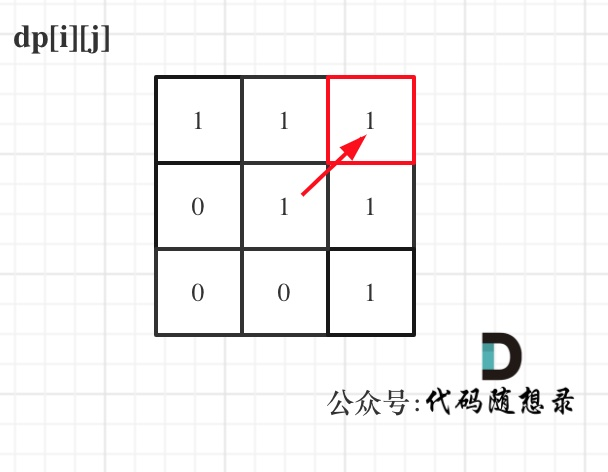

# [647. 回文子串](https://leetcode-cn.com/problems/palindromic-substrings/)

**6-23二刷**

给你一个字符串 `s` ，请你统计并返回这个字符串中 **回文子串** 的数目。

**回文字符串** 是正着读和倒过来读一样的字符串。

**子字符串** 是字符串中的由连续字符组成的一个序列。

具有不同开始位置或结束位置的子串，即使是由相同的字符组成，也会被视作不同的子串。

**示例 1：**

```
输入：s = "abc"
输出：3
解释：三个回文子串: "a", "b", "c"
```

**示例 2：**

```
输入：s = "aaa"
输出：6
解释：6个回文子串: "a", "a", "a", "aa", "aa", "aaa"
```

**提示：**

- `1 <= s.length <= 1000`
- `s` 由小写英文字母组成

### 动态规划

- **确定 dp 数组以及下标的含义**

**布尔类型的dp[i] [j]：表示区间范围[i,j] （注意是左闭右闭）的子串是否是回文子串，如果是dp[i] [j]为true，否则为false。**

- **确定递推公式**

**在确定递推公式时，就要分析如下几种情况。**

**整体上是两种，就是s[i]与s[j]相等，s[i]与s[j]不相等这两种。**

**当s[i]与s[j]不相等，那没啥好说的了，dp[i] [j]一定是false。**

**当s[i]与s[j]相等时，这就复杂一些了，有如下三种情况**

- **情况一：下标 i 与 j 相同，同一个字符例如a，当然是回文子串**
- **情况二：下标 i 与 j 相差为1，例如aa，也是回文子串**
- **情况三：下标：i 与 j 相差大于1的时候，例如cabac，此时s[i]与s[j]已经相同了，我们看i到j区间是不是回文子串就看aba是不是回文就可以了，那么aba的区间就是 i+1 与 j-1区间，这个区间是不是回文就看dp[i + 1] [j - 1]是否为true。**

- **dp 数组如何初始化**

**dp[i] [j]初始化为false。**

- **确定遍历顺序**

**首先从递推公式中可以看出，情况三是根据dp[i + 1] [j - 1]是否为true，在对dp[i] [j]进行赋值 true 的。**

**dp[i + 1] [j - 1] 在 dp[i] [j]的左下角，所以一定要从下到上，从左到右遍历，这样保证dp[i + 1] [j - 1]都是经过计算的。**

- **举例推导dp数组**

**输入："aaa"，dp 状态如下：**

**图中有6个true，所以就是有6个回文子串。**

**注意因为dp[i] [j]的定义，所以j一定是大于等于i的，那么在填充dp[i] [j]的时候一定是只填充右上半部分。**




```c++
class Solution {
public:
    int countSubstrings(string s) {
        int n = s.size();
        vector<vector<bool>> dp(n, vector<bool>(n, false));
        int result = 0;
        for (int i = n - 1; i >= 0; i--)
            for (int j = i; j < n; j++)
                if (s[i] == s[j]) {
                    if (j - i <= 1) {
                        dp[i][j] = true;
                        result++;
                    } else if (dp[i + 1][j - 1]) {
                        dp[i][j] = true;
                        result++;
                    }
                }
        return result;
    }
};
```

```c++
// 求反转后的字符串与原字符串的最长公共子序列
class Solution {
public:
    int longestPalindromeSubseq(string s) {
        int n = s.size();
        string t = s;
        reverse(t.begin(), t.end());
        vector<vector<int>> dp(n + 1, vector<int>(n + 1, 0));
        for (int i = 1; i <= n; i++) {
            for (int j = 1; j <= n; j++) {
                if (s[i - 1] == t[j - 1])
                    dp[i][j] = dp[i - 1][j - 1] + 1;
                else
                    dp[i][j] = max(dp[i - 1][j], dp[i][j - 1]);
            }
        }
        return dp[n][n];
    }
};
```

