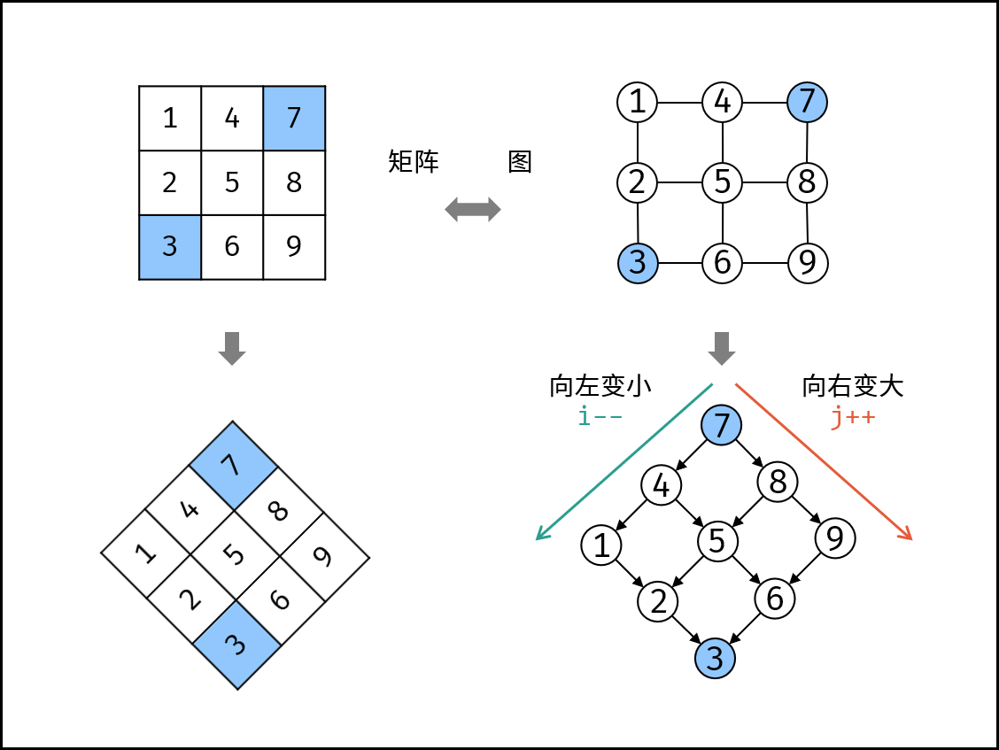

# [剑指 Offer 04. 二维数组中的查找](https://leetcode.cn/problems/er-wei-shu-zu-zhong-de-cha-zhao-lcof/)

在一个 n * m 的二维数组中，每一行都按照从左到右递增的顺序排序，每一列都按照从上到下递增的顺序排序。请完成一个高效的函数，输入这样的一个二维数组和一个整数，判断数组中是否含有该整数。

**示例:**

现有矩阵 matrix 如下：

```
[
  [1,   4,  7, 11, 15],
  [2,   5,  8, 12, 19],
  [3,   6,  9, 16, 22],
  [10, 13, 14, 17, 24],
  [18, 21, 23, 26, 30]
]
```

给定 target = `5`，返回 `true`。

给定 target = `20`，返回 `false`。

**限制：**

```
0 <= n <= 1000
0 <= m <= 1000
```

### 线性查找



```c++
// 常规二叉树搜索，从右上角开始遍历
class Solution {
public:
    bool findNumberIn2DArray(vector<vector<int>>& matrix, int target) {
        int n = matrix.size();
        if (n == 0) return false; 
        int m = matrix[0].size();
        if (m == 0) return false;
        int i = 0, j = m - 1;
        while (i < n && j >= 0) {
            if (matrix[i][j] > target) {
                j--;
            } else if (matrix[i][j] < target) {
                i++;
            } else {
                return true;
            }
        }
        return false;
    }
};
```

```c++
// 从左下角开始向上遍历，注意与右上角遍历的下标处理逻辑的差别
// 通过 && 有效的分辨出了特殊情况
// 如果数组为 [], i >= 0 不成立
// 如果数组为 [[]], j < matrix[0].size() 不成立
class Solution {
public:
    bool findNumberIn2DArray(vector<vector<int>>& matrix, int target) {
        int i = matrix.size() - 1;
        int j = 0;
        while (i >= 0 && j < matrix[0].size()) {
            if (matrix[i][j] > target) {
                i--;
            } else if (matrix[i][j] < target) {
                j++;
            } else {
                return true;
            }
        }
        return false;
    }
};
```

```c++
// 暴力查找
class Solution {
public:
    bool findNumberIn2DArray(vector<vector<int>>& matrix, int target) {
        int n = matrix.size();
        if (n == 0) return false; 
        int m = matrix[0].size();
        if (m == 0) return false;
        for (int i = 0; i < n; i++) {
            if (matrix[i][0] <= target) {
                for (int j = 0; j < m; j++) {
                    if (matrix[i][j] == target)
                        return true;
                }
            }
        }
        return false;
    }
};
```

