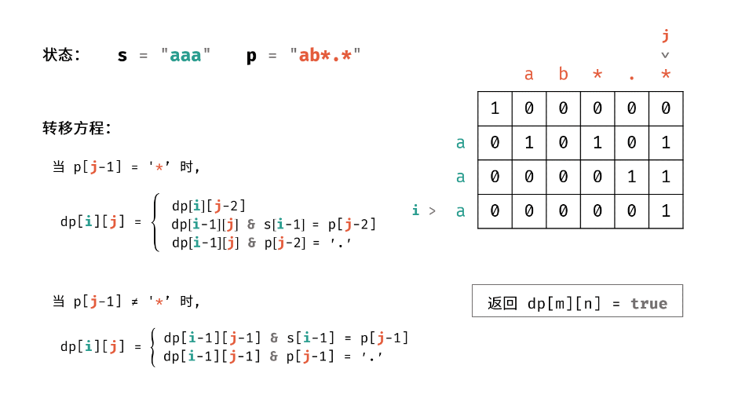

# [剑指 Offer 19. 正则表达式匹配](https://leetcode.cn/problems/zheng-ze-biao-da-shi-pi-pei-lcof/)

请实现一个函数用来匹配包含`'. '`和`'*'`的正则表达式。模式中的字符`'.'`表示任意一个字符，而`'*'`表示它前面的字符可以出现任意次（含0次）。在本题中，匹配是指字符串的所有字符匹配整个模式。例如，字符串`"aaa"`与模式`"a.a"`和`"ab*ac*a"`匹配，但与`"aa.a"`和`"ab*a"`均不匹配。

**示例 1:**

```
输入:
s = "aa"
p = "a"
输出: false
解释: "a" 无法匹配 "aa" 整个字符串。
```

**示例 2:**

```
输入:
s = "aa"
p = "a*"
输出: true
解释: 因为 '*' 代表可以匹配零个或多个前面的那一个元素, 在这里前面的元素就是 'a'。因此，字符串 "aa" 可被视为 'a' 重复了一次。
```

**示例 3:**

```
输入:
s = "ab"
p = ".*"
输出: true
解释: ".*" 表示可匹配零个或多个（'*'）任意字符（'.'）。
```

**示例 4:**

```
输入:
s = "aab"
p = "c*a*b"
输出: true
解释: 因为 '*' 表示零个或多个，这里 'c' 为 0 个, 'a' 被重复一次。因此可以匹配字符串 "aab"。
```

**示例 5:**

```
输入:
s = "mississippi"
p = "mis*is*p*."
输出: false
```

- `s` 可能为空，且只包含从 `a-z` 的小写字母。
- `p` 可能为空，且只包含从 `a-z` 的小写字母以及字符 `.` 和 `*`，无连续的 `'*'`。

### 动态规划

**本质就是字符串匹配，只不过考虑的情况稍微多一点，初始化复杂一点，确定好状态转移即可。**

- **dp[i] [j]表示前 i, j 个字符匹配，判断的时候用 i-1, j-1**

- **初始化动态数组 dp[n + 1] [m + 1] 为 false**
  - **dp[0] [0] = true 两个空字符串匹配**
  - **dp[0] [j] = dp[0] [j - 2] && p[j - 1] == '*'; 即 s 为空字符串，所以 p 偶数位都是 * 时才能匹配**
- **以下为 dp[i] [j] 为 true 的情况：**
- **i =1; i++**
  - **j = 1; j++**
    - **如果 p[j - 1] 是 ***
      - **if (dp[i] [j - 2]) 即 字符串 p[j - 2]* 出现 0 次能够匹配**
      - **if (dp[i - 1] [j] && s[i - 1] == p[j - 2]) 即让 p[j - 2] 出现多次能够匹配**
      - **if (dp[i - 1] [j] && p[j - 2] == '.') 即 p[j - 1] 是 '.' 字符出现多次能够匹配**
      - **否则不能匹配**
    - **如果 p[j - 1] 不是 ***
      - **if (dp[i - 1] [j - 1] && s[i - 1] == p[j - 1]) 即普通的字符匹配**
      - **if (dp[i - 1] [j - 1] && p[j - 1] == '.') 即 '.' 匹配任意字符**
      - **否则不能匹配**



```c++
class Solution {
public:
    bool isMatch(string s, string p) {
        // 字符串匹配三件套
        int n = s.size(), m = p.size();
        vector<vector<int>> dp(n + 1, vector<int>(m + 1, false));
        dp[0][0] = true;
        for (int j = 2; j <= m; j += 2)
            dp[0][j] = dp[0][j - 2] && p[j - 1] == '*';
        // dp[i][j]表示前i, j个字符匹配，判断的时候用i-1, j-1
        for (int i = 1; i <= n; i++) {
            for (int j = 1; j <= m; j++) {
                if (p[j - 1] == '*') {
                    if (dp[i][j - 2]) dp[i][j] = true;
                    if (dp[i - 1][j] && p[j - 2] == s[i - 1]) dp[i][j] = true;
                    if (dp[i - 1][j] && p[j - 2] == '.') dp[i][j] = true;
                } else {
                    if (dp[i - 1][j - 1] && s[i - 1] == p[j - 1]) dp[i][j] = true;
                    if (dp[i - 1][j - 1] && p[j - 1] == '.') dp[i][j] = true;
                }
            }
        }
        return dp[n][m];
    }
};
```

