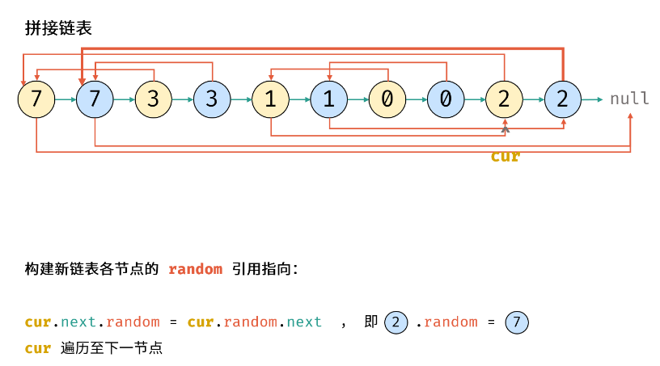

# [剑指 Offer 35. 复杂链表的复制](https://leetcode.cn/problems/fu-za-lian-biao-de-fu-zhi-lcof/)

请实现 `copyRandomList` 函数，复制一个复杂链表。在复杂链表中，每个节点除了有一个 `next` 指针指向下一个节点，还有一个 `random` 指针指向链表中的任意节点或者 `null`。

**示例 1：**


```
输入：head = [[7,null],[13,0],[11,4],[10,2],[1,0]]
输出：[[7,null],[13,0],[11,4],[10,2],[1,0]]
```

**示例 2：**


```
输入：head = [[1,1],[2,1]]
输出：[[1,1],[2,1]]
```

**示例 3：**

****

```
输入：head = [[3,null],[3,0],[3,null]]
输出：[[3,null],[3,0],[3,null]]
```

**示例 4：**

```
输入：head = []
输出：[]
解释：给定的链表为空（空指针），因此返回 null。
```

**提示：**

- `-10000 <= Node.val <= 10000`
- `Node.random` 为空（null）或指向链表中的节点。
- 节点数目不超过 1000 。

### 哈希map

**利用哈希表的查询特性，第一次遍历：构建原节点和新链表节点的映射关系，第二次遍历：将新链表的 next 和 random 指向对应节点。**

```c++
class Solution {
public:
    Node* copyRandomList(Node* head) {
        if (head == nullptr) return head;
        unordered_map<Node*, Node*> hash;
        Node* cur = head;
        // 建立映射
        while (cur != nullptr) {
            // 不能直接 hash[cur] = cur
            hash[cur] = new Node(cur->val);
            cur = cur->next;
        }
        cur = head;
        // 设置next和random指向
        while (cur != nullptr) {
            hash[cur]->next = hash[cur->next];
            hash[cur]->random = hash[cur->random];
            cur = cur->next;
        }
        return hash[head];
    }
};
```

### 拼接+拆分

- 复制各节点，拼接链表
- 构建新节点的random指向
- 拆分两链表



```c++
class Solution {
public:
    Node* copyRandomList(Node* head) {
        if (head == nullptr) return head;
        Node* cur = head;
        while (cur != nullptr) {
            Node* tmp = new Node(cur->val);
            tmp->next = cur->next;
            cur->next = tmp;
            cur = tmp->next;
        }
        cur = head;
        while (cur != nullptr) {
            if (cur->random != nullptr) {
                cur->next->random = cur->random->next;
            }
            cur = cur->next->next;
        }
        cur = head->next;
        Node* pre = head;
        Node* res = head->next;
        while (cur->next != nullptr) {
            pre->next = pre->next->next;
            cur->next = cur->next->next;
            pre = pre->next;
            cur = cur->next;
        }
        pre->next = nullptr;
        return res;
    }
};
```