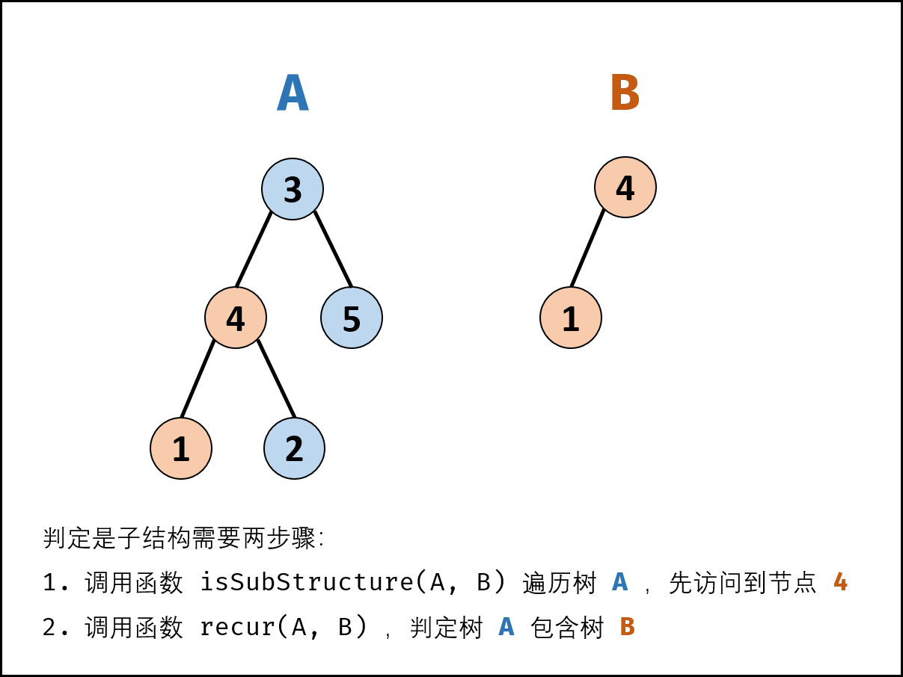

# [剑指 Offer 26. 树的子结构](https://leetcode.cn/problems/shu-de-zi-jie-gou-lcof/)

输入两棵二叉树A和B，判断B是不是A的子结构。(约定空树不是任意一个树的子结构)

B是A的子结构， 即A中有出现和B相同的结构和节点值。

例如:
给定的树 A:

`   3  / \  4  5 / \ 1  2`
给定的树 B：

`  4  / 1`
返回 true，因为 B 与 A 的一个子树拥有相同的结构和节点值。

**示例 1：**

```
输入：A = [1,2,3], B = [3,1]
输出：false
```

**示例 2：**

```
输入：A = [3,4,5,1,2], B = [4,1]
输出：true
```

**限制：**

```
0 <= 节点个数 <= 10000
```

### 递归嵌套

- 如果树 B 是树 A 的子结构，树 B 的根节点可能是树 A 的任意一个节点
  - 先序遍历树 A 的每个节点
  - 判断该以该节点为根节点的子树是否包含树 B



```c++
class Solution {
public:
    bool isSubStructure(TreeNode* A, TreeNode* B) {
        if (A == nullptr || B == nullptr) return false;
        return isContain(A, B) || isSubStructure(A->left, B)
               || isSubStructure(A->right, B);
    }
    bool isContain(TreeNode* A, TreeNode* B) {
        if (B == nullptr) return true;
        if (A == nullptr || A->val != B->val) return false;
        return isContain(A->left, B->left) && isContain(A->right, B->right);
    }
};
```

