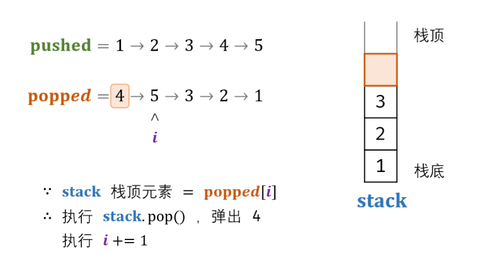

# [剑指 Offer 31. 栈的压入、弹出序列](https://leetcode.cn/problems/zhan-de-ya-ru-dan-chu-xu-lie-lcof/)

输入两个整数序列，第一个序列表示栈的压入顺序，请判断第二个序列是否为该栈的弹出顺序。假设压入栈的所有数字均不相等。例如，序列 {1,2,3,4,5} 是某栈的压栈序列，序列 {4,5,3,2,1} 是该压栈序列对应的一个弹出序列，但 {4,3,5,1,2} 就不可能是该压栈序列的弹出序列。

**示例 1：**

```
输入：pushed = [1,2,3,4,5], popped = [4,5,3,2,1]
输出：true
解释：我们可以按以下顺序执行：
push(1), push(2), push(3), push(4), pop() -> 4,
push(5), pop() -> 5, pop() -> 3, pop() -> 2, pop() -> 1
```

**示例 2：**

```
输入：pushed = [1,2,3,4,5], popped = [4,3,5,1,2]
输出：false
解释：1 不能在 2 之前弹出。
```

**提示：**

1. `0 <= pushed.length == popped.length <= 1000`
2. `0 <= pushed[i], popped[i] < 1000`
3. `pushed` 是 `popped` 的排列。

### 模拟压入弹出

借用一个辅助栈，**模拟** 压入 / 弹出操作的排列。根据是否模拟成功，即可得到结果



```c++
class Solution {
public:
    bool validateStackSequences(vector<int>& pushed, vector<int>& popped) {
        stack<int> st;
        int i = 0;
        for (int num : pushed) {
            st.push(num);
            while (!st.empty() && st.top() == popped[i]) {
                st.pop();
                i++;
            }
        }
        return st.empty();
    }
};
```

