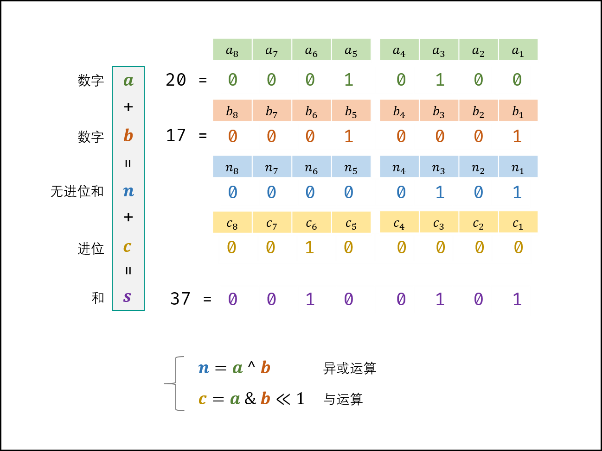

# [剑指 Offer 65. 不用加减乘除做加法](https://leetcode.cn/problems/bu-yong-jia-jian-cheng-chu-zuo-jia-fa-lcof/)

写一个函数，求两个整数之和，要求在函数体内不得使用 “+”、“-”、“*”、“/” 四则运算符号。

**示例:**

```
输入: a = 1, b = 1
输出: 2
```

**提示：**

- `a`, `b` 均可能是负数或 0
- 结果不会溢出 32 位整数

### 位运算

**因为不允许用 + 号，所以求出不进位部分和进位部分依然不能用 + 号，所以只能循环到没有进位为止。**

> Q ： 若数字 aa 和 bb 中有负数，则变成了减法，如何处理？
> A ： 在计算机系统中，数值一律用 **补码** 来表示和存储。补码的优势： 加法、减法可以统一处理（CPU只有加法器）。因此，以上方法 **同时适用于正数和负数的加法** 。



```c++
// 循环实现
class Solution {
public:
    int add(int a, int b) {
        while (b != 0) {
            // C++中负数不支持左移位，因为结果是不定的
            int c = (unsigned int)(a & b) << 1;
            a = a ^ b;
            b = c;
        }
        return a;
    }
};
```

```c++
// 递归实现
class Solution {
public:
    int add(int a, int b) {
        if (b == 0) return a;
        return add(a ^ b, (unsigned int)(a & b) << 1);
    }
};
```

